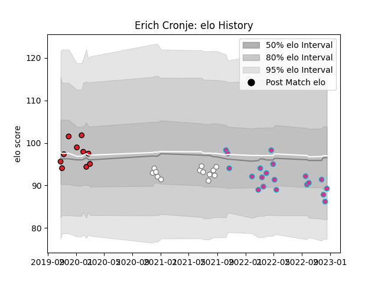

---  
layout: page  
title: Erich Cronje  
date: 2022-12-14 11:21:48.483297  
categories: player  
---
# Erich Cronje

## Positions: C, W

## Current elo: 86.0

## Current Percentile: 20.0

# Elo History

# Match History

| Team           |   Appearances |   Win Rate |
|:---------------|--------------:|-----------:|
| Zebre          |            19 |  0.0526316 |
| Pumas          |            13 |  0.461538  |
| Southern Kings |            10 |  0.1       |

| Opponent            |   Matches |   Win Rate |
|:--------------------|----------:|-----------:|
| Glasgow Warriors    |         4 |   0        |
| Griquas             |         3 |   0.833333 |
| Edinburgh           |         3 |   0        |
| Munster             |         3 |   0        |
| Golden Lions        |         3 |   0.666667 |
| Western Province    |         3 |   0.166667 |
| Connacht            |         2 |   0        |
| Free State Cheetahs |         2 |   0.5      |
| Cheetahs            |         2 |   0        |
| Leinster            |         2 |   0        |
| Ospreys             |         2 |   0.5      |
| Sharks              |         2 |   0        |
| Benetton Treviso    |         2 |   0        |
| Dragons             |         1 |   1        |
| Cardiff Blues       |         1 |   0        |
| Blue Bulls          |         1 |   0        |
| Bulls               |         1 |   0        |
| Natal Sharks        |         1 |   0        |
| Scarlets            |         1 |   0        |
| Stormers            |         1 |   0        |
| Toulon              |         1 |   0        |
| Ulster              |         1 |   0        |