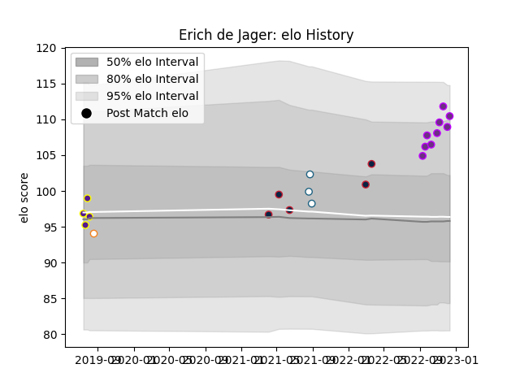

---  
layout: page  
title: Erich de Jager  
date: 2023-02-02 18:55:47.581848  
categories: player  
---
# Erich de Jager

## Positions: P

## Current elo: 97.0

## Current Percentile: 72.0

# Elo History

# Match History

| Team                   |   Appearances |   Win Rate |
|:-----------------------|--------------:|-----------:|
| US Bressane            |            12 |   0.833333 |
| Free State Cheetahs    |             9 |   0.444444 |
| Griffons               |             5 |   0.6      |
| Griquas                |             5 |   0.3      |
| New England Free Jacks |             5 |   0.8      |

| Opponent                   |   Matches |   Win Rate |
|:---------------------------|----------:|-----------:|
| Blue Bulls                 |         4 |      0.25  |
| Pumas                      |         4 |      0.875 |
| Austin Gilgronis           |         2 |      1     |
| Golden Lions               |         2 |      0     |
| Blagnac                    |         2 |      0.5   |
| Western Province           |         2 |      0.5   |
| Cognac Saint Jean d'Angély |         2 |      1     |
| Dax                        |         1 |      0     |
| Rennes                     |         1 |      1     |
| Valke                      |         1 |      0.5   |
| Valence Romans Drome Rugby |         1 |      1     |
| Utah Warriors              |         1 |      1     |
| Tarbes                     |         1 |      1     |
| Suresnes                   |         1 |      1     |
| Seattle Seawolves          |         1 |      1     |
| SWD Eagles                 |         1 |      0.5   |
| Bourgoin-Jallieu           |         1 |      1     |
| Eastern Province Kings     |         1 |      1     |
| Nice                       |         1 |      1     |
| Natal Sharks               |         1 |      0     |
| Chambery                   |         1 |      1     |
| L. A. Giltinis             |         1 |      0     |
| Jaguares XV                |         1 |      0     |
| Free State Cheetahs        |         1 |      0     |
| Leopards                   |         1 |      1     |