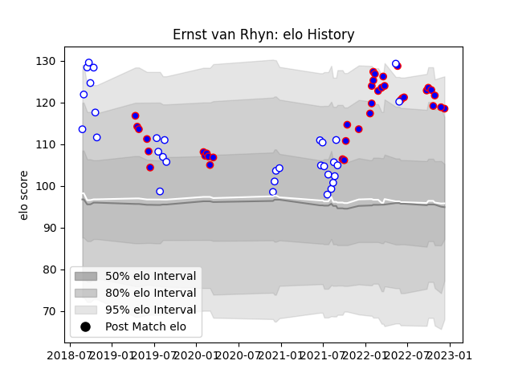

---  
layout: page  
title: Ernst van Rhyn  
date: 2022-12-14 11:20:38.426147  
categories: player  
---
# Ernst van Rhyn

## Positions: FL, L

## Current elo: 118.0

## Current Percentile: 94.0

# Elo History

# Match History

| Team             |   Appearances |   Win Rate |
|:-----------------|--------------:|-----------:|
| Stormers         |            36 |   0.652778 |
| Western Province |            25 |   0.56     |

| Opponent            |   Matches |   Win Rate |
|:--------------------|----------:|-----------:|
| Golden Lions        |         6 |   0.333333 |
| Pumas               |         5 |   1        |
| Lions               |         5 |   0.6      |
| Bulls               |         4 |   1        |
| Sharks              |         4 |   0.375    |
| Natal Sharks        |         4 |   0.75     |
| Blue Bulls          |         4 |   0.75     |
| Edinburgh           |         3 |   0.833333 |
| Free State Cheetahs |         3 |   0.333333 |
| Griquas             |         3 |   0        |
| Scarlets            |         2 |   1        |
| Ulster              |         2 |   1        |
| Cardiff Blues       |         2 |   0.5      |
| Connacht            |         2 |   0.5      |
| Benetton Treviso    |         1 |   0        |
| Sunwolves           |         1 |   1        |
| Ospreys             |         1 |   0.5      |
| Hurricanes          |         1 |   1        |
| Munster             |         1 |   0        |
| Melbourne Rebels    |         1 |   1        |
| Jaguares            |         1 |   1        |
| Dragons             |         1 |   1        |
| Clermont Auvergne   |         1 |   0        |
| Brumbies            |         1 |   0        |
| Blues               |         1 |   0        |
| Zebre               |         1 |   1        |