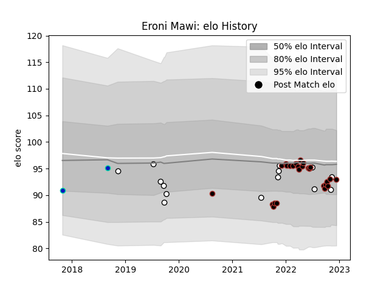

---  
layout: page  
title: Eroni Mawi  
date: 2022-11-16 11:27:05.595434  
categories: player  
---
# Eroni Mawi

## Positions: P

## Country: Fiji

## Current elo: 94.0

## Current Percentile: 30.0

# Elo History

# Match History

| Team     |   Appearances |   Win Rate |
|:---------|--------------:|-----------:|
| Saracens |            25 |   0.68     |
| Fiji     |            14 |   0.321429 |

| Opponent           |   Matches |   Win Rate |
|:-------------------|----------:|-----------:|
| Gloucester Rugby   |         3 |   0.333333 |
| Harlequins         |         3 |   1        |
| Leicester Tigers   |         3 |   0.333333 |
| Newcastle Falcons  |         3 |   1        |
| Bristol Rugby      |         2 |   0.5      |
| Exeter Chiefs      |         2 |   0.5      |
| Wales              |         2 |   0        |
| Tonga              |         2 |   1        |
| Bath Rugby         |         2 |   1        |
| Scotland           |         2 |   0        |
| Sale Sharks        |         2 |   1        |
| Australia          |         1 |   0        |
| Samoa              |         1 |   0        |
| Wasps              |         1 |   0        |
| Uruguay            |         1 |   0        |
| Spain              |         1 |   1        |
| New Zealand Maori  |         1 |   1        |
| Northampton Saints |         1 |   1        |
| New Zealand        |         1 |   0        |
| London Irish       |         1 |   0        |
| Ireland            |         1 |   0        |
| Georgia            |         1 |   0.5      |
| Brive              |         1 |   1        |
| Worcester Warriors |         1 |   1        |