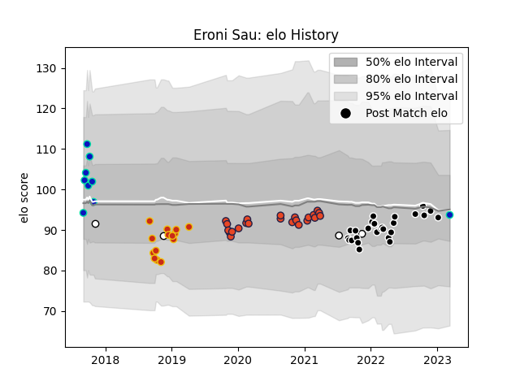

---  
layout: page  
title: Eroni Sau  
date: 2023-01-13 11:27:11.109523  
categories: player  
---
# Eroni Sau

## Positions: W

## Country: Fiji

## Current elo: 90.0

## Current Percentile: 34.0

# Elo History

# Match History

| Team           |   Appearances |   Win Rate |
|:---------------|--------------:|-----------:|
| Provence Rugby |            26 |   0.538462 |
| Edinburgh      |            23 |   0.586957 |
| Perpignan      |            14 |   0        |
| Fijian Drua    |             8 |   0.5      |
| Fiji           |             3 |   0.333333 |

| Opponent             |   Matches |   Win Rate |
|:---------------------|----------:|-----------:|
| Connacht             |         5 |   0.4      |
| Agen                 |         4 |   0.5      |
| Glasgow Warriors     |         3 |   0.666667 |
| Scarlets             |         3 |   0.666667 |
| Bordeaux Begles      |         3 |   0.166667 |
| Nevers               |         3 |   0.333333 |
| Aurillac             |         3 |   0.333333 |
| Cardiff Blues        |         3 |   0.666667 |
| Grenoble             |         3 |   0.5      |
| US Bressane          |         2 |   0.75     |
| Sale Sharks          |         2 |   0        |
| Pau                  |         2 |   0        |
| Narbonne             |         2 |   0        |
| Munster              |         2 |   0.5      |
| Dragons              |         2 |   0.5      |
| Colomiers            |         2 |   0.5      |
| Bayonne              |         2 |   0.5      |
| Beziers              |         2 |   1        |
| Queensland Country   |         1 |   0        |
| Wales                |         1 |   0        |
| Vannes               |         1 |   1        |
| Uruguay              |         1 |   1        |
| Ulster               |         1 |   0        |
| Toulon               |         1 |   0        |
| Sydney Rays          |         1 |   0        |
| Stade Francais Paris |         1 |   0        |
| Southern Kings       |         1 |   1        |
| Benetton Treviso     |         1 |   0        |
| Rouen                |         1 |   0        |
| Perth Spirit         |         1 |   1        |
| Greater Sydney Rams  |         1 |   1        |
| Biarritz Olympique   |         1 |   0        |
| Oyonnax              |         1 |   1        |
| New Zealand          |         1 |   0        |
| Brisbane City        |         1 |   0        |
| Canberra Vikings     |         1 |   0        |
| NSW Country Eagles   |         1 |   1        |
| Carcassonne          |         1 |   1        |
| Montpellier Herault  |         1 |   0        |
| Mont-de-Marsan       |         1 |   1        |
| Melbourne Rising     |         1 |   1        |
| Leinster             |         1 |   0        |
| La Rochelle          |         1 |   0        |
| Zebre                |         1 |   1        |