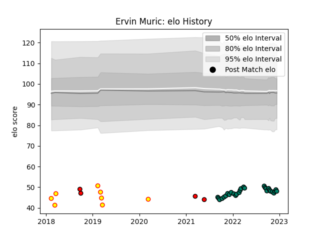

---  
layout: page  
title: Ervin Muric  
date: 2022-11-22 11:27:34.402848  
categories: player  
---
# Ervin Muric

## Positions: W, C

## Country: Belgium

## Current elo: 48.0

## Current Percentile: 0.0

# Elo History

# Match History

| Team             |   Appearances |   Win Rate |
|:-----------------|--------------:|-----------:|
| Suresnes         |            26 |       0.5  |
| Belgium          |             8 |       0.25 |
| Hartpury College |             4 |       0.25 |

| Opponent                   |   Matches |   Win Rate |
|:---------------------------|----------:|-----------:|
| Albi                       |         3 |   0.333333 |
| Tarbes                     |         3 |   1        |
| Spain                      |         3 |   0.333333 |
| Dax                        |         2 |   0.5      |
| Romania                    |         2 |   0        |
| Nice                       |         2 |   0.5      |
| Georgia                    |         2 |   0        |
| Valence Romans Drome Rugby |         2 |   0        |
| Cognac Saint Jean d'Angély |         2 |   1        |
| Chambery                   |         2 |   0        |
| Bourgoin-Jallieu           |         2 |   0.5      |
| Coventry                   |         1 |   1        |
| Dijon                      |         1 |   1        |
| Aubenas                    |         1 |   0        |
| Jersey                     |         1 |   0        |
| Narbonne                   |         1 |   0        |
| Carqueiranne-Hyères        |         1 |   1        |
| Rennes                     |         1 |   1        |
| Richmond                   |         1 |   0        |
| Soyaux-Angouleme           |         1 |   0        |
| Blagnac                    |         1 |   1        |
| Bedford                    |         1 |   0        |
| US Bressane                |         1 |   0        |
| Germany                    |         1 |   1        |