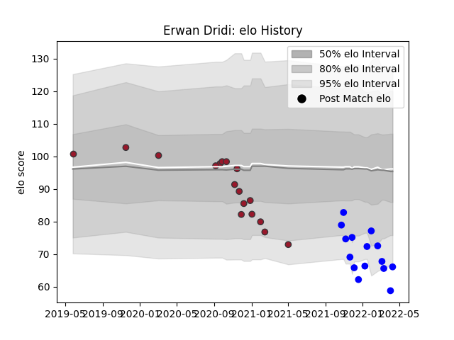

---  
layout: page  
title: Erwan Dridi  
date: 2023-03-17 17:19:37.345660  
categories: player  
---
# Erwan Dridi

## Positions: W, FB

## Current elo: 66.0

## Current Percentile: 3.0

# Elo History

# Match History

| Team   |   Appearances |   Win Rate |
|:-------|--------------:|-----------:|
| Toulon |            17 |   0.647059 |
| Vannes |            15 |   0.6      |

| Opponent             |   Matches |   Win Rate |
|:---------------------|----------:|-----------:|
| Agen                 |         2 |       1    |
| Beziers              |         2 |       0.5  |
| Stade Francais Paris |         2 |       0.5  |
| Brive                |         2 |       0.5  |
| Carcassonne          |         2 |       0.25 |
| Rouen                |         2 |       0    |
| Provence Rugby       |         2 |       0.5  |
| La Rochelle          |         2 |       0    |
| Bayonne              |         2 |       0.5  |
| Montpellier Herault  |         1 |       1    |
| Scarlets             |         1 |       1    |
| Pau                  |         1 |       1    |
| Nevers               |         1 |       1    |
| Narbonne             |         1 |       0.5  |
| Leicester Tigers     |         1 |       1    |
| Montauban            |         1 |       1    |
| Mont-de-Marsan       |         1 |       1    |
| Grenoble             |         1 |       1    |
| Colomiers            |         1 |       1    |
| Clermont Auvergne    |         1 |       1    |
| Castres Olympique    |         1 |       1    |
| Bordeaux Begles      |         1 |       0    |
| US Bressane          |         1 |       1    |