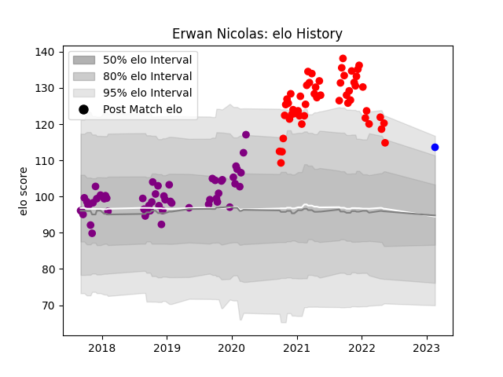

---  
layout: page  
title: Erwan Nicolas  
date: 2023-02-24 02:34:11.983201  
categories: player  
---
# Erwan Nicolas

## Positions: SH

## Current elo: 114.0

## Current Percentile: 93.0

# Elo History

# Match History

| Team             |   Appearances |   Win Rate |
|:-----------------|--------------:|-----------:|
| Soyaux-Angouleme |            54 |   0.490741 |
| Rouen            |            51 |   0.372549 |
| Vannes           |             1 |   0        |

| Opponent                   |   Matches |   Win Rate |
|:---------------------------|----------:|-----------:|
| Carcassonne                |         8 |   0.1875   |
| Aurillac                   |         8 |   0.5      |
| Mont-de-Marsan             |         8 |   0.25     |
| Montauban                  |         7 |   0.5      |
| Nevers                     |         7 |   0.357143 |
| Vannes                     |         7 |   0.428571 |
| Biarritz Olympique         |         7 |   0.428571 |
| Grenoble                   |         6 |   0.333333 |
| Beziers                    |         6 |   0.666667 |
| Colomiers                  |         6 |   0.333333 |
| Provence Rugby             |         5 |   0.7      |
| Oyonnax                    |         4 |   0.5      |
| Bayonne                    |         4 |   0        |
| Perpignan                  |         4 |   0.375    |
| Massy                      |         3 |   0.833333 |
| Narbonne                   |         3 |   0.666667 |
| US Bressane                |         3 |   0.166667 |
| Soyaux-Angouleme           |         2 |   1        |
| Valence Romans Drome Rugby |         2 |   0.5      |
| Brive                      |         2 |   0        |
| Roval Drome XV             |         2 |   0.5      |
| Rouen                      |         1 |   1        |
| Agen                       |         1 |   1        |