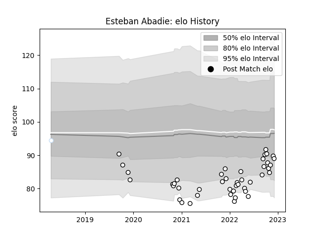

---  
layout: page  
title: Esteban Abadie  
date: 2023-01-06 00:10:53.269901  
categories: player  
---
# Esteban Abadie

## Positions: FL, N8

## Current elo: 105.0

## Current Percentile: 40.0

# Elo History

# Match History

| Team      |   Appearances |   Win Rate |
|:----------|--------------:|-----------:|
| Brive     |            47 |   0.223404 |
| Racing 92 |             1 |   0        |

| Opponent             |   Matches |   Win Rate |
|:---------------------|----------:|-----------:|
| Lyon                 |         6 |   0.166667 |
| Stade Toulousain     |         5 |   0        |
| Clermont Auvergne    |         5 |   0.4      |
| La Rochelle          |         4 |   0        |
| Toulon               |         3 |   0.333333 |
| Castres Olympique    |         3 |   0.333333 |
| Stade Francais Paris |         3 |   0.333333 |
| Racing 92            |         3 |   0.333333 |
| Montpellier Herault  |         3 |   0.166667 |
| Pau                  |         2 |   0        |
| Perpignan            |         2 |   0.5      |
| Zebre                |         2 |   0        |
| Bordeaux Begles      |         2 |   0        |
| Biarritz Olympique   |         1 |   1        |
| Leicester Tigers     |         1 |   0        |
| Edinburgh            |         1 |   0        |
| Bristol Rugby        |         1 |   0        |
| Bayonne              |         1 |   1        |