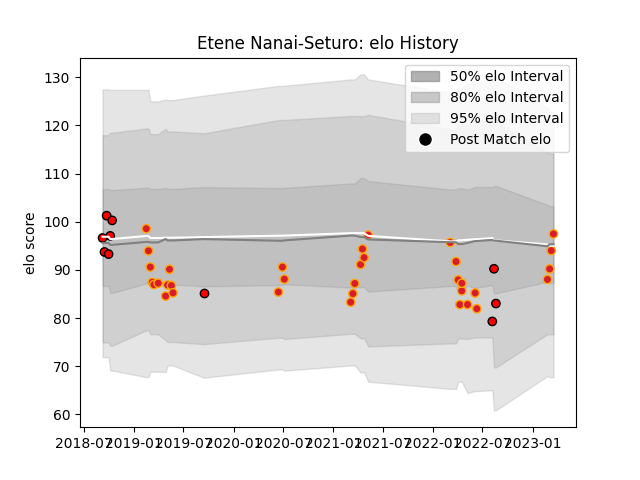

---  
layout: page  
title: Etene Nanai-Seturo  
date: 2023-03-17 17:08:09.108506  
categories: player  
---
# Etene Nanai-Seturo

## Positions: W, FB

## Current elo: 94.0

## Current Percentile: 33.0

# Elo History

# Match History

| Team             |   Appearances |   Win Rate |
|:-----------------|--------------:|-----------:|
| Chiefs           |            33 |   0.454545 |
| Counties Manukau |            10 |   0.2      |

| Opponent                 |   Matches |   Win Rate |
|:-------------------------|----------:|-----------:|
| Crusaders                |         8 |   0.25     |
| Highlanders              |         6 |   0.416667 |
| Hurricanes               |         6 |   0.583333 |
| Moana Pasifika           |         3 |   1        |
| Blues                    |         3 |   0        |
| Brumbies                 |         2 |   0        |
| Auckland                 |         1 |   0        |
| Queensland Reds          |         1 |   1        |
| Waikato                  |         1 |   0        |
| Tasman                   |         1 |   0        |
| Sunwolves                |         1 |   0        |
| Southland                |         1 |   1        |
| Sharks                   |         1 |   1        |
| New South Wales Waratahs |         1 |   1        |
| Otago                    |         1 |   1        |
| Northland                |         1 |   0        |
| North Harbour            |         1 |   0        |
| Jaguares                 |         1 |   1        |
| Hawke's Bay              |         1 |   0        |
| Canterbury               |         1 |   0        |
| Wellington               |         1 |   0        |