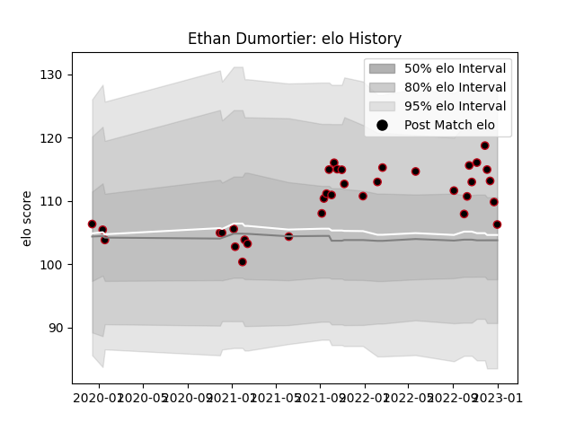

---  
layout: page  
title: Ethan Dumortier  
date: 2023-01-06 00:15:04.364963  
categories: player  
---
# Ethan Dumortier

## Positions: W

## Current elo: 106.0

## Current Percentile: 72.0

# Elo History

# Match History

| Team   |   Appearances |   Win Rate |
|:-------|--------------:|-----------:|
| Lyon   |            35 |   0.457143 |

| Opponent             |   Matches |   Win Rate |
|:---------------------|----------:|-----------:|
| Bordeaux Begles      |         4 |   0.25     |
| Castres Olympique    |         3 |   0.666667 |
| Clermont Auvergne    |         3 |   0.333333 |
| Pau                  |         3 |   0.333333 |
| Montpellier Herault  |         3 |   0.666667 |
| La Rochelle          |         2 |   0.5      |
| Stade Toulousain     |         2 |   1        |
| Stade Francais Paris |         2 |   1        |
| Brive                |         2 |   0.5      |
| Racing 92            |         2 |   0        |
| Northampton Saints   |         1 |   0        |
| Perpignan            |         1 |   1        |
| Agen                 |         1 |   1        |
| Leinster             |         1 |   0        |
| Bayonne              |         1 |   0        |
| Bulls                |         1 |   0        |
| Biarritz Olympique   |         1 |   1        |
| Benetton Treviso     |         1 |   0        |
| Toulon               |         1 |   0        |