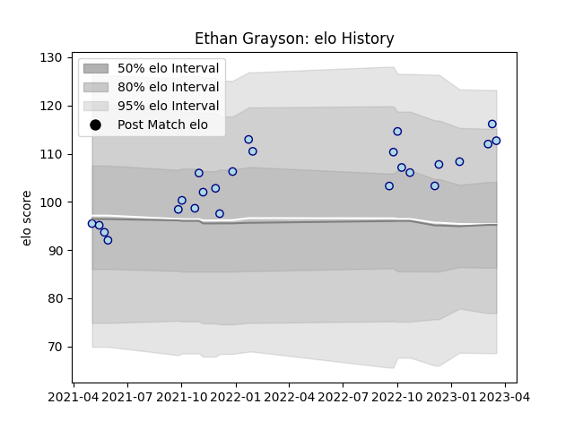

---  
layout: page  
title: Ethan Grayson  
date: 2023-03-17 17:06:08.783193  
categories: player  
---
# Ethan Grayson

## Positions: C

## Current elo: 116.0

## Current Percentile: 87.0

# Elo History

# Match History

| Team    |   Appearances |   Win Rate |
|:--------|--------------:|-----------:|
| Bedford |            24 |   0.541667 |

| Opponent            |   Matches |   Win Rate |
|:--------------------|----------:|-----------:|
| Doncaster           |         4 |   0.5      |
| Hartpury College    |         4 |   0.75     |
| Ealing Trailfinders |         3 |   0        |
| Nottingham          |         3 |   0.666667 |
| Jersey              |         2 |   0.5      |
| London Scottish     |         2 |   1        |
| Richmond            |         2 |   0        |
| Ampthill            |         1 |   1        |
| Caldy               |         1 |   1        |
| Cornish Pirates     |         1 |   1        |
| Coventry            |         1 |   0        |