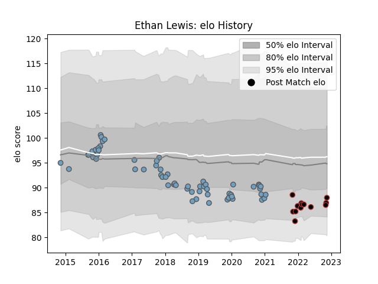

---  
layout: page  
title: Ethan Lewis  
date: 2022-11-15 23:40:03.313221  
categories: player  
---
# Ethan Lewis

## Positions: H

## Current elo: 88.0

## Current Percentile: 13.0

# Elo History

# Match History

| Team          |   Appearances |   Win Rate |
|:--------------|--------------:|-----------:|
| Cardiff Blues |            61 |   0.409836 |
| Saracens      |            13 |   0.807692 |

| Opponent            |   Matches |   Win Rate |
|:--------------------|----------:|-----------:|
| Ospreys             |         6 |   0.166667 |
| Glasgow Warriors    |         5 |   0        |
| Dragons             |         4 |   1        |
| Leicester Tigers    |         4 |   0.25     |
| Scarlets            |         4 |   0.75     |
| Benetton Treviso    |         4 |   0.5      |
| Calvisano           |         3 |   1        |
| Connacht            |         3 |   0.666667 |
| Edinburgh           |         3 |   0.666667 |
| Harlequins          |         3 |   0.666667 |
| Leinster            |         3 |   0        |
| Sale Sharks         |         3 |   0.666667 |
| Munster             |         3 |   0        |
| Worcester Warriors  |         2 |   0.5      |
| Ulster              |         2 |   0        |
| Southern Kings      |         2 |   1        |
| Northampton Saints  |         2 |   1        |
| Montpellier Herault |         2 |   0.5      |
| Zebre               |         2 |   0.5      |
| Newcastle Falcons   |         2 |   0.5      |
| London Irish        |         2 |   0.25     |
| Cheetahs            |         2 |   0        |
| Pau                 |         1 |   1        |
| Lyon                |         1 |   1        |
| Saracens            |         1 |   0        |
| Exeter Chiefs       |         1 |   0        |
| Stade Toulousain    |         1 |   1        |
| Wasps               |         1 |   0        |
| Bristol Rugby       |         1 |   1        |
| Bath Rugby          |         1 |   1        |