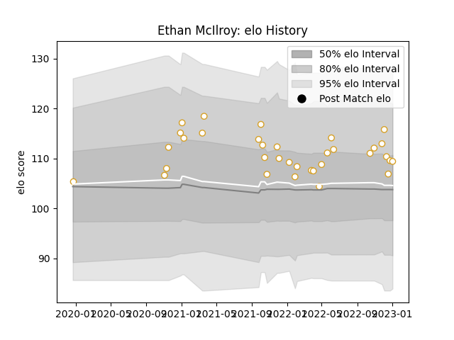

---  
layout: page  
title: Ethan McIlroy  
date: 2023-01-06 00:20:58.396909  
categories: player  
---
# Ethan McIlroy

## Positions: W, FB

## Current elo: 109.0

## Current Percentile: 71.0

# Elo History

# Match History

| Team   |   Appearances |   Win Rate |
|:-------|--------------:|-----------:|
| Ulster |            34 |   0.617647 |

| Opponent         |   Matches |   Win Rate |
|:-----------------|----------:|-----------:|
| Munster          |         6 |       0.5  |
| Leinster         |         4 |       0.25 |
| Connacht         |         4 |       0.75 |
| Zebre            |         4 |       1    |
| Glasgow Warriors |         2 |       1    |
| Lions            |         2 |       1    |
| Stormers         |         2 |       0    |
| Dragons          |         1 |       1    |
| Edinburgh        |         1 |       1    |
| La Rochelle      |         1 |       0    |
| Bulls            |         1 |       0    |
| Cardiff Blues    |         1 |       1    |
| Ospreys          |         1 |       0    |
| Sale Sharks      |         1 |       0    |
| Scarlets         |         1 |       1    |
| Sharks           |         1 |       1    |
| Benetton Treviso |         1 |       1    |