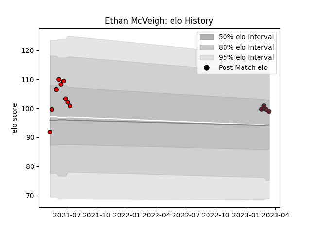

---  
layout: page  
title: Ethan McVeigh  
date: 2023-03-16 19:54:52.837859  
categories: player  
---
# Ethan McVeigh

## Positions: SH

## Current elo: 99.0

## Current Percentile: None

# Elo History

# Match History

| Team             |   Appearances |   Win Rate |
|:-----------------|--------------:|-----------:|
| San Diego Legion |             9 |   0.444444 |
| American Raptors |             4 |   0        |

| Opponent          |   Matches |   Win Rate |
|:------------------|----------:|-----------:|
| Seattle Seawolves |         2 |        0.5 |
| Austin Gilgronis  |         1 |        0   |
| Houston SaberCats |         1 |        1   |
| L. A. Giltinis    |         1 |        0   |
| NOLA Gold         |         1 |        1   |
| Old Glory DC      |         1 |        0   |
| Pampas XV         |         1 |        0   |
| Penarol Rugby     |         1 |        0   |
| Selknam           |         1 |        0   |
| Toronto Arrows    |         1 |        1   |
| Utah Warriors     |         1 |        0   |
| Yacare XV         |         1 |        0   |