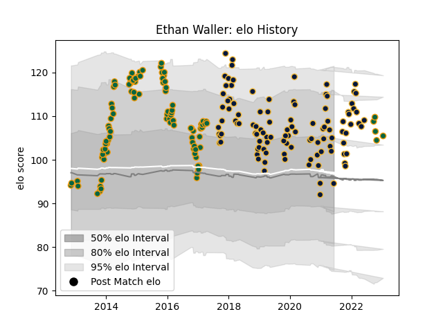

---  
layout: page  
title: Ethan Waller  
date: 2023-01-17 11:38:18.938713  
categories: player  
---
# Ethan Waller

## Positions: P

## Current elo: 95.0

## Current Percentile: 75.0

# Elo History

# Match History

| Team               |   Appearances |   Win Rate |
|:-------------------|--------------:|-----------:|
| Worcester Warriors |           106 |   0.320755 |
| Northampton Saints |           101 |   0.648515 |

| Opponent             |   Matches |   Win Rate |
|:---------------------|----------:|-----------:|
| Saracens             |        16 |   0.4375   |
| Leicester Tigers     |        16 |   0.25     |
| Gloucester Rugby     |        15 |   0.6      |
| London Irish         |        14 |   0.714286 |
| Exeter Chiefs        |        14 |   0.285714 |
| Harlequins           |        14 |   0.428571 |
| Newcastle Falcons    |        14 |   0.464286 |
| Sale Sharks          |        13 |   0.615385 |
| Bath Rugby           |        12 |   0.333333 |
| Wasps                |        12 |   0.333333 |
| Northampton Saints   |        10 |   0.1      |
| Bristol Rugby        |         9 |   0.444444 |
| Ospreys              |         7 |   0.857143 |
| Worcester Warriors   |         6 |   0.833333 |
| Castres Olympique    |         5 |   0.4      |
| Leinster             |         4 |   0.25     |
| Scarlets             |         4 |   1        |
| Dragons              |         3 |   0.666667 |
| Racing 92            |         3 |   0.166667 |
| Benetton Treviso     |         2 |   1        |
| Montpellier Herault  |         2 |   0.5      |
| Glasgow Warriors     |         2 |   1        |
| Pau                  |         2 |   0.5      |
| Connacht             |         2 |   0.25     |
| Stade Francais Paris |         2 |   1        |
| Munster              |         1 |   0        |
| RC Enisei            |         1 |   1        |
| Brive                |         1 |   1        |
| London Welsh         |         1 |   1        |