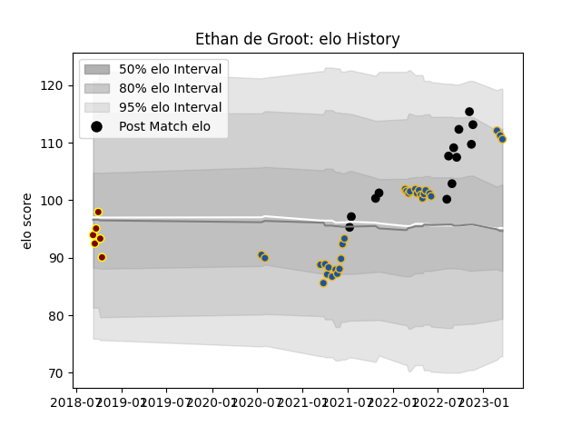

---  
layout: page  
title: Ethan de Groot  
date: 2023-03-02 11:28:15.969509  
categories: player  
---
# Ethan de Groot

## Positions: P

## Country: New Zealand

## Current elo: 113.0

## Current Percentile: 84.0

# Elo History

# Match History

| Team        |   Appearances |   Win Rate |
|:------------|--------------:|-----------:|
| Highlanders |            27 |   0.444444 |
| New Zealand |            13 |   0.807692 |
| Southland   |             6 |   0        |

| Opponent                 |   Matches |   Win Rate |
|:-------------------------|----------:|-----------:|
| Blues                    |         6 |   0.166667 |
| Hurricanes               |         4 |   0        |
| Chiefs                   |         3 |   0.333333 |
| Crusaders                |         3 |   0.333333 |
| Argentina                |         2 |   0.5      |
| South Africa             |         2 |   0.5      |
| Queensland Reds          |         2 |   1        |
| Melbourne Rebels         |         2 |   0.5      |
| Australia                |         2 |   1        |
| Western Force            |         2 |   1        |
| Fiji                     |         2 |   1        |
| Brumbies                 |         2 |   0.5      |
| Fijian Drua              |         1 |   1        |
| Italy                    |         1 |   1        |
| England                  |         1 |   0.5      |
| Counties Manukau         |         1 |   0        |
| Moana Pasifika           |         1 |   1        |
| New South Wales Waratahs |         1 |   1        |
| Northland                |         1 |   0        |
| Otago                    |         1 |   0        |
| Scotland                 |         1 |   1        |
| Bay of Plenty            |         1 |   0        |
| United States of America |         1 |   1        |
| Waikato                  |         1 |   0        |
| Wales                    |         1 |   1        |
| Manawatu                 |         1 |   0        |