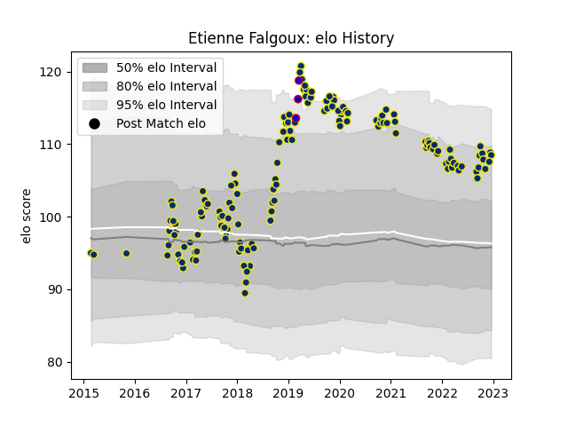

---  
layout: page  
title: Etienne Falgoux  
date: 2022-12-14 11:36:22.191203  
categories: player  
---
# Etienne Falgoux

## Positions: P

## Country: France

## Current elo: 109.0

## Current Percentile: 87.0

# Elo History

# Match History

| Team              |   Appearances |   Win Rate |
|:------------------|--------------:|-----------:|
| Clermont Auvergne |           143 |   0.629371 |
| France            |             3 |   0.666667 |

| Opponent             |   Matches |   Win Rate |
|:---------------------|----------:|-----------:|
| Bordeaux Begles      |        13 |   0.538462 |
| Castres Olympique    |        12 |   0.5      |
| Lyon                 |        11 |   0.818182 |
| Racing 92            |        11 |   0.454545 |
| La Rochelle          |        10 |   0.55     |
| Toulon               |        10 |   0.5      |
| Stade Francais Paris |        10 |   0.75     |
| Pau                  |         9 |   0.666667 |
| Montpellier Herault  |         8 |   0.5      |
| Stade Toulousain     |         6 |   0.25     |
| Perpignan            |         5 |   0.8      |
| Northampton Saints   |         5 |   0.8      |
| Agen                 |         5 |   0.8      |
| Brive                |         4 |   0.75     |
| Ulster               |         4 |   0.5      |
| Harlequins           |         3 |   1        |
| Saracens             |         3 |   0.666667 |
| Bayonne              |         2 |   0.5      |
| Ospreys              |         2 |   1        |
| Oyonnax              |         2 |   0.25     |
| Grenoble             |         2 |   1        |
| Biarritz Olympique   |         2 |   1        |
| Leinster             |         1 |   1        |
| Italy                |         1 |   1        |
| Ireland              |         1 |   0        |
| Exeter Chiefs        |         1 |   1        |
| Scotland             |         1 |   1        |
| Dragons              |         1 |   1        |
| Stormers             |         1 |   1        |