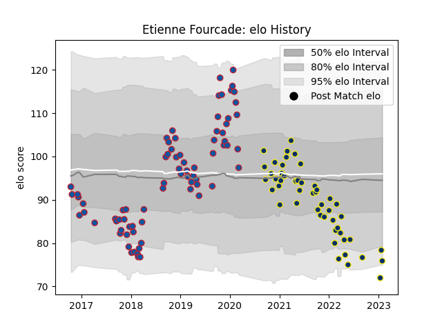

---  
layout: page  
title: Etienne Fourcade  
date: 2023-01-15 11:44:03.310746  
categories: player  
---
# Etienne Fourcade

## Positions: H

## Current elo: 72.0

## Current Percentile: 7.0

# Elo History

# Match History

| Team              |   Appearances |   Win Rate |
|:------------------|--------------:|-----------:|
| Grenoble          |            75 |       0.44 |
| Clermont Auvergne |            47 |       0.5  |

| Opponent             |   Matches |   Win Rate |
|:---------------------|----------:|-----------:|
| Perpignan            |         8 |   0.375    |
| Lyon                 |         7 |   0.285714 |
| Racing 92            |         7 |   0.142857 |
| Montpellier Herault  |         6 |   0.333333 |
| Stade Francais Paris |         6 |   0.5      |
| Toulon               |         6 |   0.5      |
| La Rochelle          |         6 |   0.333333 |
| Bordeaux Begles      |         6 |   0.416667 |
| Stade Toulousain     |         6 |   0.333333 |
| Castres Olympique    |         5 |   0.4      |
| Brive                |         4 |   0.75     |
| Biarritz Olympique   |         4 |   0.375    |
| Beziers              |         4 |   0.75     |
| Nevers               |         4 |   0.5      |
| Montauban            |         4 |   0.5      |
| Aurillac             |         3 |   0.666667 |
| Pau                  |         3 |   0.333333 |
| Agen                 |         3 |   0.5      |
| Bayonne              |         3 |   0.666667 |
| Carcassonne          |         3 |   1        |
| Colomiers            |         3 |   0.333333 |
| Mont-de-Marsan       |         2 |   0.5      |
| Narbonne             |         2 |   0.75     |
| Soyaux-Angouleme     |         2 |   1        |
| Vannes               |         2 |   0.5      |
| Oyonnax              |         2 |   0.5      |
| Ospreys              |         2 |   0        |
| Newcastle Falcons    |         2 |   0.5      |
| Dax                  |         1 |   1        |
| Leicester Tigers     |         1 |   0        |
| Rouen                |         1 |   1        |
| Roval Drome XV       |         1 |   1        |
| Clermont Auvergne    |         1 |   0.5      |
| Massy                |         1 |   0        |
| Provence Rugby       |         1 |   1        |