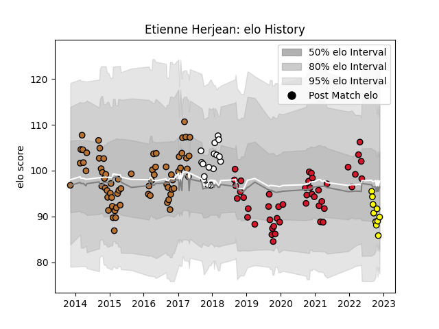

---  
layout: page  
title: Etienne Herjean  
date: 2022-12-09 13:03:59.745581  
categories: player  
---
# Etienne Herjean

## Positions: N8, FL

## Current elo: 86.0

## Current Percentile: 21.0

# Elo History

# Match History

| Team        |   Appearances |   Win Rate |
|:------------|--------------:|-----------:|
| Narbonne    |            68 |   0.485294 |
| Oyonnax     |            46 |   0.663043 |
| Brive       |            16 |   0.21875  |
| Carcassonne |            12 |   0.416667 |

| Opponent                   |   Matches |   Win Rate |
|:---------------------------|----------:|-----------:|
| Colomiers                  |        12 |   0.375    |
| Beziers                    |        11 |   0.772727 |
| Biarritz Olympique         |        10 |   0.3      |
| Montauban                  |         8 |   0.875    |
| Vannes                     |         7 |   0.428571 |
| Aurillac                   |         7 |   0.428571 |
| Mont-de-Marsan             |         6 |   0.416667 |
| Albi                       |         6 |   0.416667 |
| Soyaux-Angouleme           |         6 |   0.833333 |
| Provence Rugby             |         5 |   0.6      |
| Carcassonne                |         5 |   0.6      |
| Dax                        |         5 |   0.8      |
| Rouen                      |         4 |   0.75     |
| Perpignan                  |         4 |   0.25     |
| Pau                        |         4 |   0        |
| Agen                       |         4 |   0.75     |
| Bourgoin-Jallieu           |         4 |   0.625    |
| Massy                      |         3 |   0.333333 |
| Oyonnax                    |         3 |   0.333333 |
| Castres Olympique          |         2 |   0.5      |
| Bayonne                    |         2 |   0.5      |
| Grenoble                   |         2 |   0        |
| Narbonne                   |         2 |   1        |
| Nevers                     |         2 |   0.5      |
| Tarbes                     |         2 |   0.5      |
| Lyon                       |         2 |   0.5      |
| Racing 92                  |         2 |   0        |
| Auch                       |         1 |   0        |
| Valence Romans Drome Rugby |         1 |   1        |
| US Bressane                |         1 |   1        |
| Stade Toulousain           |         1 |   0        |
| La Rochelle                |         1 |   0        |
| Roval Drome XV             |         1 |   1        |
| Bordeaux Begles            |         1 |   0.5      |
| Clermont Auvergne          |         1 |   0        |
| Newcastle Falcons          |         1 |   0        |
| Montpellier Herault        |         1 |   0        |
| Connacht                   |         1 |   0        |
| Worcester Warriors         |         1 |   1        |