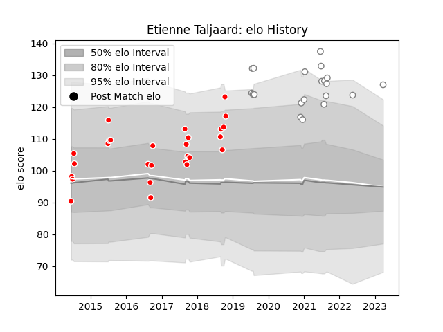

---  
layout: page  
title: Etienne Taljaard  
date: 2023-03-27 11:35:15.476808  
categories: player  
---
# Etienne Taljaard

Last updated: 2023-03-27
## Positions: W

## Current elo: 127.0

## Current Percentile: 93.0

# Elo History

# Match History

| Team   |   Appearances |   Win Rate |
|:-------|--------------:|-----------:|
| Valke  |            27 |   0.518519 |
| Pumas  |            20 |   0.45     |

| Opponent               |   Matches |   Win Rate |
|:-----------------------|----------:|-----------:|
| Griquas                |         6 |   0.583333 |
| Border Bulldogs        |         5 |   0.8      |
| Griffons               |         5 |   0.4      |
| Leopards               |         5 |   0.2      |
| SWD Eagles             |         5 |   0.4      |
| Golden Lions           |         4 |   0.5      |
| Western Province       |         4 |   0.125    |
| Blue Bulls             |         3 |   0.333333 |
| Boland Cavaliers       |         2 |   0.5      |
| Eastern Province Kings |         2 |   1        |
| Free State Cheetahs    |         2 |   0.5      |
| Namibia Welwitchias    |         2 |   1        |
| Natal Sharks           |         2 |   0.5      |