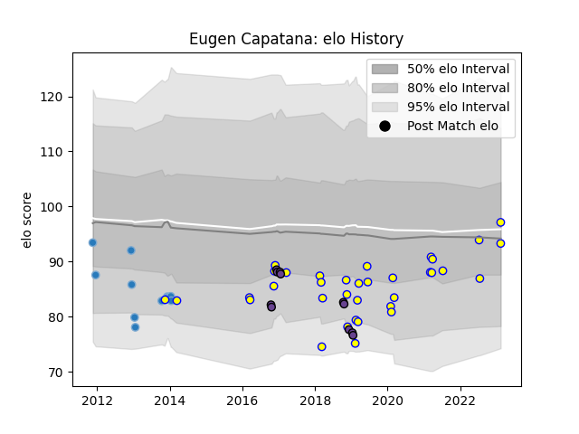

---  
layout: page  
title: Eugen Capatana  
date: 2023-02-15 22:13:22.954880  
categories: player  
---
# Eugen Capatana

## Positions: H

## Country: Romania

## Current elo: 97.0

## Current Percentile: 23.0

# Elo History

# Match History

| Team               |   Appearances |   Win Rate |
|:-------------------|--------------:|-----------:|
| Romania            |            35 |   0.6      |
| Bucuresti          |            11 |   0.181818 |
| Timisoara Saracens |            11 |   0        |

| Opponent                 |   Matches |   Win Rate |
|:-------------------------|----------:|-----------:|
| Belgium                  |         6 |   1        |
| Georgia                  |         5 |   0        |
| Uruguay                  |         4 |   0.5      |
| Spain                    |         4 |   0.5      |
| Russia                   |         4 |   0.5      |
| Stade Francais Paris     |         3 |   0        |
| Portugal                 |         3 |   0.666667 |
| Germany                  |         2 |   1        |
| United States of America |         2 |   0.5      |
| Newcastle Falcons        |         2 |   0        |
| Harlequins               |         2 |   0        |
| Agen                     |         2 |   0.5      |
| Edinburgh                |         2 |   0        |
| Dragons                  |         2 |   0        |
| Clermont Auvergne        |         2 |   0        |
| Calvisano                |         2 |   0.5      |
| Brive                    |         2 |   0        |
| Argentina                |         1 |   0        |
| Northampton Saints       |         1 |   0        |
| Chile                    |         1 |   1        |
| Canada                   |         1 |   1        |
| Tonga                    |         1 |   1        |
| Brazil                   |         1 |   1        |
| Bath Rugby               |         1 |   0        |
| Worcester Warriors       |         1 |   0        |