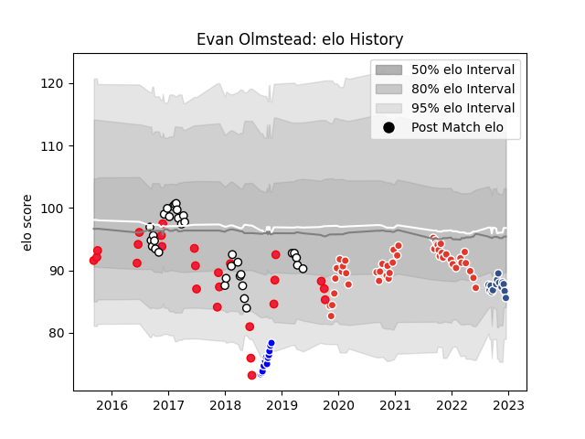

---  
layout: page  
title: Evan Olmstead  
date: 2022-12-18 16:13:56.329318  
categories: player  
---
# Evan Olmstead

## Positions: L, FL

## Country: Canada

## Current elo: 86.0

## Current Percentile: 15.0

# Elo History

# Match History

| Team               |   Appearances |   Win Rate |
|:-------------------|--------------:|-----------:|
| Biarritz Olympique |            45 |   0.455556 |
| Newcastle Falcons  |            33 |   0.454545 |
| Canada             |            25 |   0.22     |
| Agen               |            14 |   0.428571 |
| Auckland           |            12 |   0.916667 |

| Opponent                 |   Matches |   Win Rate |
|:-------------------------|----------:|-----------:|
| Perpignan                |         5 |   0.2      |
| Saracens                 |         4 |   0        |
| Vannes                   |         4 |   0.75     |
| United States of America |         4 |   0.125    |
| Sale Sharks              |         4 |   0.75     |
| Rouen                    |         3 |   1        |
| Provence Rugby           |         3 |   0.833333 |
| Oyonnax                  |         3 |   0.333333 |
| Exeter Chiefs            |         3 |   0.333333 |
| Leicester Tigers         |         3 |   0        |
| Soyaux-Angouleme         |         3 |   0.666667 |
| Gloucester Rugby         |         3 |   0.666667 |
| Carcassonne              |         3 |   0.666667 |
| Bath Rugby               |         3 |   0.666667 |
| Wasps                    |         3 |   0.333333 |
| Montauban                |         3 |   0.333333 |
| Grenoble                 |         3 |   0.666667 |
| Northampton Saints       |         2 |   1        |
| Nevers                   |         2 |   0        |
| Montpellier Herault      |         2 |   0        |
| Pau                      |         2 |   0        |
| Romania                  |         2 |   0        |
| Russia                   |         2 |   0.5      |
| Stade Toulousain         |         2 |   0        |
| Toulon                   |         2 |   0        |
| Wellington               |         2 |   1        |
| Lyon                     |         2 |   0        |
| Worcester Warriors       |         2 |   0        |
| Colomiers                |         2 |   0        |
| Beziers                  |         2 |   0.5      |
| Fiji                     |         2 |   0        |
| Italy                    |         2 |   0        |
| Bristol Rugby            |         2 |   0.5      |
| Brive                    |         2 |   0.5      |
| Castres Olympique        |         2 |   0        |
| Canterbury               |         2 |   1        |
| Harlequins               |         2 |   0.5      |
| Stade Francais Paris     |         1 |   1        |
| Scotland                 |         1 |   0        |
| South Africa             |         1 |   0        |
| Southland                |         1 |   1        |
| Spain                    |         1 |   1        |
| La Rochelle              |         1 |   0        |
| Clermont Auvergne        |         1 |   0        |
| Tasman                   |         1 |   1        |
| Uruguay                  |         1 |   0        |
| Bordeaux Begles          |         1 |   1        |
| Waikato                  |         1 |   1        |
| Biarritz Olympique       |         1 |   1        |
| Taranaki                 |         1 |   1        |
| Counties Manukau         |         1 |   1        |
| Samoa                    |         1 |   0        |
| London Irish             |         1 |   1        |
| Kenya                    |         1 |   1        |
| Massy                    |         1 |   1        |
| Mont-de-Marsan           |         1 |   1        |
| Japan                    |         1 |   0        |
| Ireland                  |         1 |   0        |
| New Zealand              |         1 |   0        |
| North Harbour            |         1 |   1        |
| Hong Kong                |         1 |   1        |
| Northland                |         1 |   1        |
| Otago                    |         1 |   0        |
| Germany                  |         1 |   1        |
| Georgia                  |         1 |   0        |
| France                   |         1 |   0        |
| Racing 92                |         1 |   1        |
| Dragons                  |         1 |   1        |
| Aurillac                 |         1 |   1        |