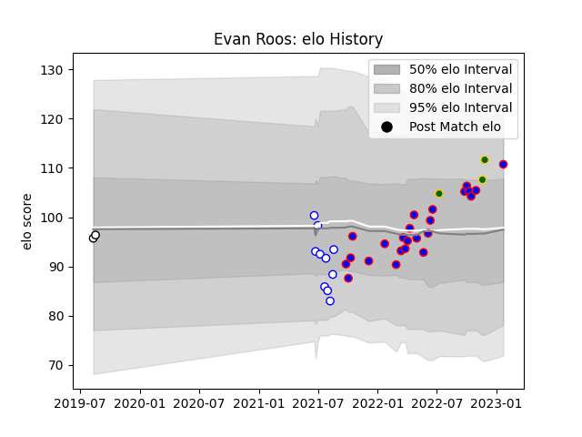

---  
layout: page  
title: Evan Roos  
date: 2022-11-22 11:46:10.140832  
categories: player  
---
# Evan Roos

## Positions: N8

## Country: South Africa

## Current elo: 103.0

## Current Percentile: 68.0

# Elo History

# Match History

| Team             |   Appearances |   Win Rate |
|:-----------------|--------------:|-----------:|
| Stormers         |            23 |   0.782609 |
| Western Province |             9 |   0.5      |
| South Africa     |             2 |   0.5      |

| Opponent            |   Matches |   Win Rate |
|:--------------------|----------:|-----------:|
| Bulls               |         3 |   1        |
| Edinburgh           |         3 |   0.833333 |
| Zebre               |         2 |   1        |
| Connacht            |         2 |   0.5      |
| Ulster              |         2 |   1        |
| Pumas               |         2 |   0.75     |
| Golden Lions        |         2 |   0.5      |
| Ospreys             |         2 |   0.75     |
| Blue Bulls          |         2 |   0.5      |
| Lions               |         2 |   0.5      |
| Munster             |         1 |   0        |
| Wales               |         1 |   0        |
| Scarlets            |         1 |   1        |
| Natal Sharks        |         1 |   1        |
| Benetton Treviso    |         1 |   0        |
| Leinster            |         1 |   1        |
| Griquas             |         1 |   0        |
| Glasgow Warriors    |         1 |   1        |
| Free State Cheetahs |         1 |   0        |
| Dragons             |         1 |   1        |
| Cardiff Blues       |         1 |   1        |
| Italy               |         1 |   1        |