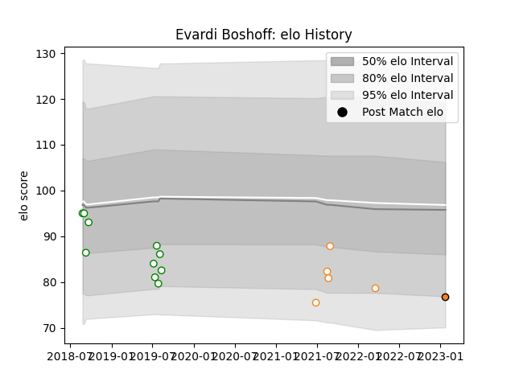

---  
layout: page  
title: Evardi Boshoff  
date: 2023-01-23 15:32:52.924279  
categories: player  
---
# Evardi Boshoff

## Positions: C, FH

## Current elo: 77.0

## Current Percentile: 12.0

# Elo History

# Match History

| Team                |   Appearances |   Win Rate |
|:--------------------|--------------:|-----------:|
| Leopards            |            10 |        0.7 |
| Free State Cheetahs |             5 |        0.2 |
| Cheetahs            |             1 |        1   |

| Opponent               |   Matches |   Win Rate |
|:-----------------------|----------:|-----------:|
| Boland Cavaliers       |         2 |        1   |
| Border Bulldogs        |         2 |        1   |
| Eastern Province Kings |         2 |        1   |
| SWD Eagles             |         2 |        0.5 |
| Blue Bulls             |         1 |        0   |
| Griffons               |         1 |        0   |
| Griquas                |         1 |        0   |
| Natal Sharks           |         1 |        0   |
| Pau                    |         1 |        1   |
| Pumas                  |         1 |        0   |
| Valke                  |         1 |        0   |
| Western Province       |         1 |        1   |