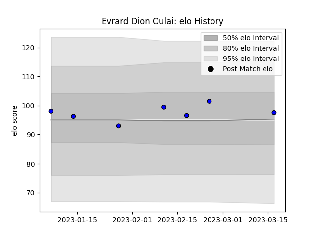

---  
layout: page  
title: Evrard Dion Oulai  
date: 2023-02-24 02:22:30.758858  
categories: player  
---
# Evrard Dion Oulai

## Positions: L

## Current elo: 99.0

## Current Percentile: 68.0

# Elo History

# Match History

| Team   |   Appearances |   Win Rate |
|:-------|--------------:|-----------:|
| Massy  |             7 |   0.285714 |

| Opponent         |   Matches |   Win Rate |
|:-----------------|----------:|-----------:|
| Agen             |         1 |          0 |
| Aurillac         |         1 |          0 |
| Grenoble         |         1 |          0 |
| Mont-de-Marsan   |         1 |          0 |
| Montauban        |         1 |          1 |
| Soyaux-Angouleme |         1 |          0 |
| Vannes           |         1 |          1 |