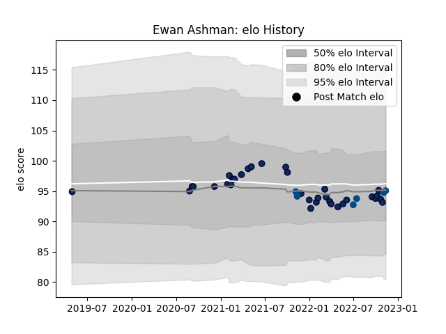

---  
layout: page  
title: Ewan Ashman  
date: 2023-03-17 17:31:08.738049  
categories: player  
---
# Ewan Ashman

## Positions: H

## Country: Scotland

## Current elo: 90.0

## Current Percentile: 35.0

# Elo History

# Match History

| Team        |   Appearances |   Win Rate |
|:------------|--------------:|-----------:|
| Sale Sharks |            47 |   0.617021 |
| Scotland    |             6 |   0.333333 |

| Opponent           |   Matches |   Win Rate |
|:-------------------|----------:|-----------:|
| Exeter Chiefs      |         6 |   0.333333 |
| Leicester Tigers   |         6 |   1        |
| Bath Rugby         |         5 |   0.7      |
| Saracens           |         5 |   0.4      |
| London Irish       |         4 |   0.625    |
| Wasps              |         4 |   1        |
| Harlequins         |         4 |   0.5      |
| Bristol Rugby      |         3 |   0.666667 |
| Newcastle Falcons  |         2 |   0.5      |
| Ospreys            |         2 |   1        |
| Argentina          |         2 |   0        |
| New Zealand        |         1 |   0        |
| Australia          |         1 |   1        |
| Northampton Saints |         1 |   0        |
| Gloucester Rugby   |         1 |   1        |
| Fiji               |         1 |   1        |
| South Africa       |         1 |   0        |
| Stade Toulousain   |         1 |   0        |
| Ulster             |         1 |   0        |
| Clermont Auvergne  |         1 |   0        |
| Worcester Warriors |         1 |   1        |