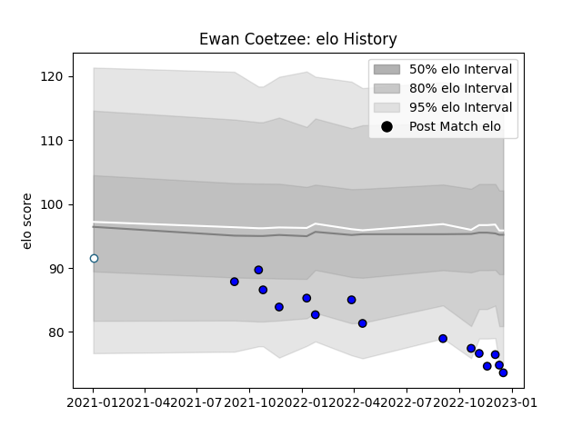

---  
layout: page  
title: Ewan Coetzee  
date: 2022-11-22 11:31:23.974473  
categories: player  
---
# Ewan Coetzee

## Positions: L, FL

## Current elo: 75.0

## Current Percentile: 6.0

# Elo History

# Match History

| Team    |   Appearances |   Win Rate |
|:--------|--------------:|-----------:|
| Massy   |            12 |        0.5 |
| Griquas |             1 |        0   |

| Opponent                   |   Matches |   Win Rate |
|:---------------------------|----------:|-----------:|
| Blagnac                    |         2 |        0.5 |
| Aubenas                    |         1 |        1   |
| Biarritz Olympique         |         1 |        0   |
| Chambery                   |         1 |        1   |
| Cognac Saint Jean d'Angély |         1 |        1   |
| Dax                        |         1 |        1   |
| Dijon                      |         1 |        1   |
| Montauban                  |         1 |        0   |
| Natal Sharks               |         1 |        0   |
| Oyonnax                    |         1 |        0   |
| Soyaux-Angouleme           |         1 |        0   |
| Vannes                     |         1 |        0   |