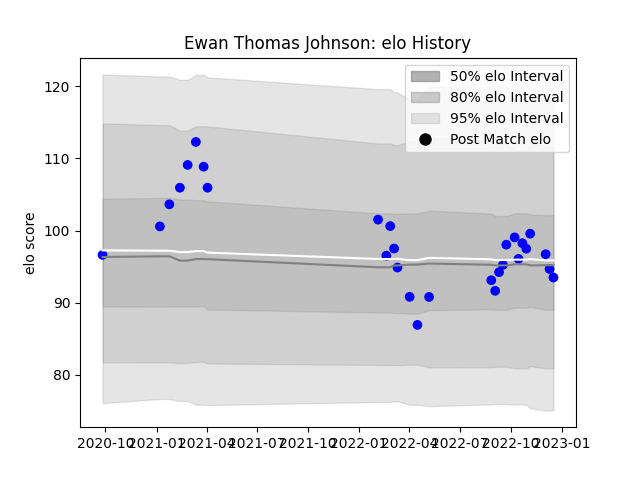

---  
layout: page  
title: Ewan Thomas Johnson  
date: 2022-12-18 16:34:57.980168  
categories: player  
---
# Ewan Thomas Johnson

## Positions: L

## Current elo: 93.0

## Current Percentile: 47.0

# Elo History

# Match History

| Team   |   Appearances |   Win Rate |
|:-------|--------------:|-----------:|
| Vannes |            29 |   0.586207 |

| Opponent                   |   Matches |   Win Rate |
|:---------------------------|----------:|-----------:|
| Aurillac                   |         3 |   0.666667 |
| Carcassonne                |         3 |   0.666667 |
| Colomiers                  |         3 |   0.666667 |
| Agen                       |         2 |   0        |
| Soyaux-Angouleme           |         2 |   0.5      |
| Rouen                      |         2 |   0        |
| Montauban                  |         2 |   1        |
| Valence Romans Drome Rugby |         2 |   0.5      |
| Beziers                    |         2 |   0.5      |
| Massy                      |         1 |   1        |
| Grenoble                   |         1 |   1        |
| Nevers                     |         1 |   1        |
| Oyonnax                    |         1 |   0        |
| Provence Rugby             |         1 |   1        |
| Biarritz Olympique         |         1 |   1        |
| US Bressane                |         1 |   1        |
| Mont-de-Marsan             |         1 |   0        |