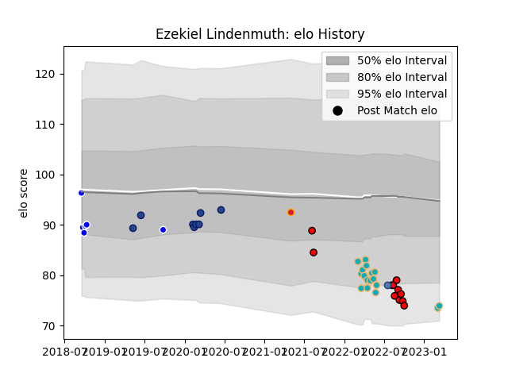

---  
layout: page  
title: Ezekiel Lindenmuth  
date: 2023-03-04 11:35:32.947521  
categories: player  
---
# Ezekiel Lindenmuth

## Positions: P

## Country: Samoa

## Current elo: 74.0

## Current Percentile: 7.0

# Elo History

# Match History

| Team             |   Appearances |   Win Rate |
|:-----------------|--------------:|-----------:|
| Moana Pasifika   |            15 |   0.133333 |
| Counties Manukau |            11 |   0.272727 |
| Blues            |             8 |   0.625    |
| Auckland         |             6 |   0.666667 |
| Chiefs           |             1 |   0        |
| Samoa            |             1 |   1        |

| Opponent                 |   Matches |   Win Rate |
|:-------------------------|----------:|-----------:|
| Hurricanes               |         6 |   0.5      |
| Chiefs                   |         4 |   0        |
| Wellington               |         3 |   0.333333 |
| New South Wales Waratahs |         2 |   0.5      |
| Canterbury               |         2 |   0.5      |
| Crusaders                |         2 |   0        |
| Southland                |         2 |   0.5      |
| Otago                    |         2 |   0.5      |
| Blues                    |         2 |   0        |
| Manawatu                 |         2 |   0.5      |
| North Harbour            |         2 |   0        |
| Bay of Plenty            |         1 |   1        |
| Waikato                  |         1 |   0        |
| Taranaki                 |         1 |   1        |
| Queensland Reds          |         1 |   0        |
| Lions                    |         1 |   1        |
| Melbourne Rebels         |         1 |   0        |
| Highlanders              |         1 |   0        |
| Hawke's Bay              |         1 |   0        |
| Fijian Drua              |         1 |   0        |
| Fiji                     |         1 |   1        |
| Bulls                    |         1 |   1        |
| Brumbies                 |         1 |   1        |
| Western Force            |         1 |   0        |