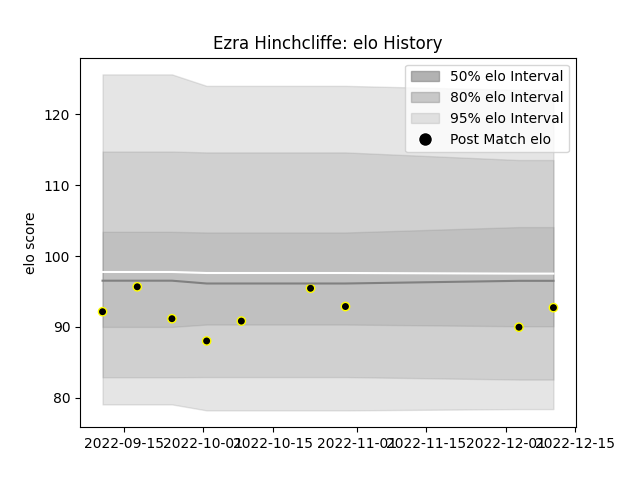

---  
layout: page  
title: Ezra Hinchcliffe  
date: 2022-12-14 11:27:51.447656  
categories: player  
---
# Ezra Hinchcliffe

## Positions: FH

## Current elo: 93.0

## Current Percentile: 24.0

# Elo History

# Match History

| Team   |   Appearances |   Win Rate |
|:-------|--------------:|-----------:|
| Caldy  |             9 |   0.222222 |

| Opponent         |   Matches |   Win Rate |
|:-----------------|----------:|-----------:|
| Ampthill         |         1 |          0 |
| Bedford          |         1 |          0 |
| Cornish Pirates  |         1 |          1 |
| Coventry         |         1 |          0 |
| Hartpury College |         1 |          0 |
| Jersey           |         1 |          0 |
| London Scottish  |         1 |          0 |
| Nottingham       |         1 |          0 |
| Richmond         |         1 |          1 |