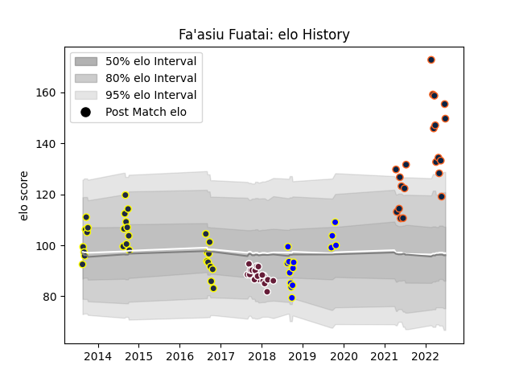

---  
layout: page  
title: Fa'asiu Fuatai  
date: 2023-03-21 18:30:47.677306  
categories: player  
---
# Fa'asiu Fuatai

Last updated: 2023-03-21
## Positions: W, C

## Current elo: 150.0

## Current Percentile: 99.0

# Elo History

# Match History

| Team            |   Appearances |   Win Rate |
|:----------------|--------------:|-----------:|
| Otago           |            28 |   0.464286 |
| R.U. New York   |            25 |   0.64     |
| Rugby New York  |            21 |   0.761905 |
| Bordeaux Begles |            18 |   0.416667 |
| Bay of Plenty   |            14 |   0.571429 |

| Opponent               |   Matches |   Win Rate |
|:-----------------------|----------:|-----------:|
| Rugby ATL              |         8 |   0.625    |
| New England Free Jacks |         8 |   0.375    |
| Old Glory DC           |         6 |   1        |
| Seattle Seawolves      |         5 |   1        |
| North Harbour          |         5 |   0.6      |
| Hawke's Bay            |         4 |   0.25     |
| Northland              |         4 |   0.75     |
| NOLA Gold              |         4 |   0.75     |
| Southland              |         4 |   0.75     |
| Manawatu               |         4 |   0.5      |
| Canterbury             |         4 |   0        |
| Toronto Arrows         |         4 |   0.5      |
| Bay of Plenty          |         4 |   0.75     |
| San Diego Legion       |         3 |   1        |
| Houston SaberCats      |         3 |   1        |
| Tasman                 |         3 |   0.333333 |
| Waikato                |         3 |   0.666667 |
| Counties Manukau       |         3 |   0.333333 |
| L. A. Giltinis         |         3 |   0.666667 |
| Clermont Auvergne      |         2 |   0.5      |
| Montpellier Herault    |         2 |   0.5      |
| Toulon                 |         2 |   0.5      |
| Lyon                   |         2 |   0.5      |
| Taranaki               |         2 |   1        |
| Dragons                |         2 |   0.5      |
| Stade Toulousain       |         1 |   0        |
| Stade Francais Paris   |         1 |   1        |
| Utah Warriors          |         1 |   0        |
| Agen                   |         1 |   1        |
| Racing 92              |         1 |   0        |
| Pau                    |         1 |   0        |
| Otago                  |         1 |   0        |
| Auckland               |         1 |   0        |
| Castres Olympique      |         1 |   0        |
| Brive                  |         1 |   0.5      |
| Austin Gilgronis       |         1 |   0        |
| Newcastle Falcons      |         1 |   0        |