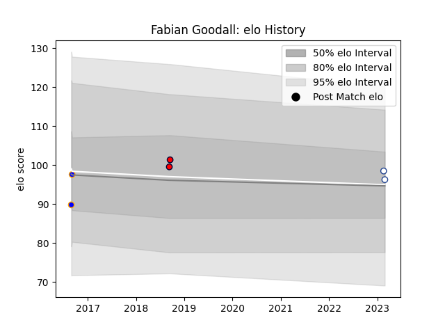

---  
layout: page  
title: Fabian Goodall  
date: 2023-03-21 18:47:48.019797  
categories: player  
---
# Fabian Goodall

Last updated: 2023-03-21
## Positions: W, C

## Current elo: 93.0

## Current Percentile: 50.0

# Elo History

# Match History

| Team                |   Appearances |   Win Rate |
|:--------------------|--------------:|-----------:|
| Toronto Arrows      |             3 |        0   |
| Greater Sydney Rams |             2 |        0   |
| Melbourne Rising    |             2 |        0.5 |

| Opponent           |   Matches |   Win Rate |
|:-------------------|----------:|-----------:|
| Brisbane City      |         1 |          0 |
| NSW Country Eagles |         1 |          1 |
| North Harbour Rays |         1 |          0 |
| Old Glory DC       |         1 |          0 |
| Queensland Country |         1 |          0 |
| Rugby ATL          |         1 |          0 |
| Rugby New York     |         1 |          0 |