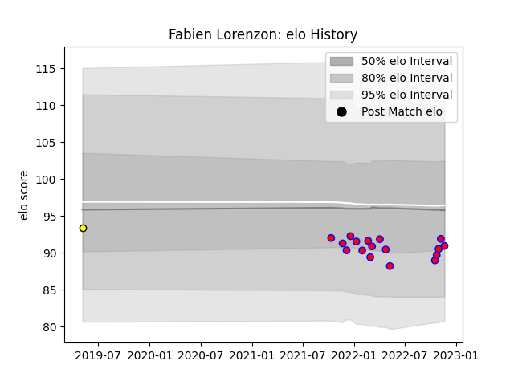

---  
layout: page  
title: Fabien Lorenzon  
date: 2022-12-14 11:29:02.158450  
categories: player  
---
# Fabien Lorenzon

## Positions: P

## Current elo: 92.0

## Current Percentile: 27.0

# Elo History

# Match History

| Team        |   Appearances |   Win Rate |
|:------------|--------------:|-----------:|
| Blagnac     |            20 |      0.525 |
| Carcassonne |             1 |      0     |

| Opponent                   |   Matches |   Win Rate |
|:---------------------------|----------:|-----------:|
| Bourgoin-Jallieu           |         2 |        1   |
| Chambery                   |         2 |        0.5 |
| Dax                        |         2 |        0   |
| Dijon                      |         2 |        0.5 |
| Massy                      |         2 |        0   |
| Soyaux-Angouleme           |         2 |        0   |
| Suresnes                   |         2 |        0.5 |
| Carqueiranne-Hyères        |         1 |        1   |
| Cognac Saint Jean d'Angély |         1 |        1   |
| Narbonne                   |         1 |        0.5 |
| Nice                       |         1 |        0   |
| Rennes                     |         1 |        1   |
| Tarbes                     |         1 |        1   |
| Valence Romans Drome Rugby |         1 |        1   |