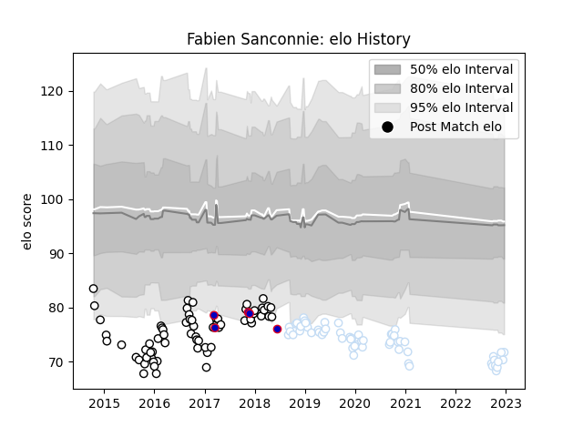

---  
layout: page  
title: Fabien Sanconnie  
date: 2022-12-14 11:12:52.180197  
categories: player  
---
# Fabien Sanconnie

## Positions: FL, N8

## Country: France

## Current elo: 70.0

## Current Percentile: 3.0

# Elo History

# Match History

| Team      |   Appearances |   Win Rate |
|:----------|--------------:|-----------:|
| Brive     |            64 |   0.421875 |
| Racing 92 |            60 |   0.6      |
| France    |             5 |   0.5      |

| Opponent             |   Matches |   Win Rate |
|:---------------------|----------:|-----------:|
| Montpellier Herault  |        10 |   0.9      |
| Stade Toulousain     |         9 |   0.166667 |
| Clermont Auvergne    |         9 |   0.388889 |
| Toulon               |         8 |   0.5      |
| Bordeaux Begles      |         8 |   0.25     |
| La Rochelle          |         7 |   0.428571 |
| Pau                  |         7 |   0.714286 |
| Lyon                 |         7 |   0.357143 |
| Stade Francais Paris |         5 |   0.4      |
| Oyonnax              |         5 |   0.6      |
| Agen                 |         5 |   0.8      |
| Grenoble             |         4 |   0.5      |
| Castres Olympique    |         4 |   0.5      |
| Racing 92            |         4 |   0.25     |
| Brive                |         3 |   1        |
| Perpignan            |         3 |   1        |
| Ospreys              |         2 |   1        |
| Ulster               |         2 |   0.5      |
| Saracens             |         2 |   0.5      |
| RC Enisei            |         2 |   0.5      |
| Dragons              |         2 |   0.5      |
| Connacht             |         2 |   0.5      |
| New Zealand          |         2 |   0        |
| Munster              |         2 |   0.75     |
| Gloucester Rugby     |         2 |   0        |
| Zebre                |         2 |   0        |
| Newcastle Falcons    |         1 |   0        |
| Italy                |         1 |   1        |
| Bath Rugby           |         1 |   0        |
| Exeter Chiefs        |         1 |   0        |
| Leinster             |         1 |   0        |
| Scarlets             |         1 |   1        |
| Leicester Tigers     |         1 |   1        |
| Bayonne              |         1 |   1        |
| Japan                |         1 |   0.5      |
| Wales                |         1 |   1        |
| Worcester Warriors   |         1 |   1        |