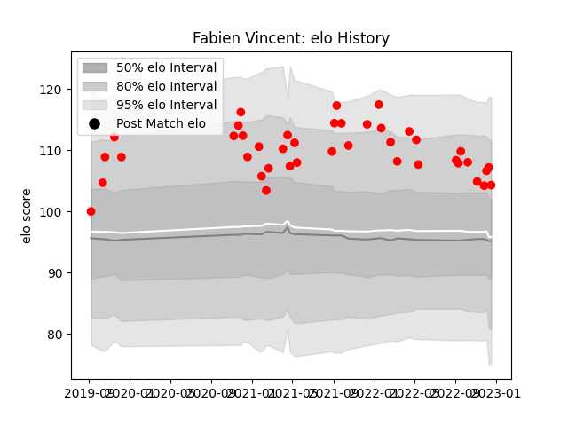

---  
layout: page  
title: Fabien Vincent  
date: 2022-12-18 16:37:08.385692  
categories: player  
---
# Fabien Vincent

## Positions: FL

## Current elo: 104.0

## Current Percentile: 83.0

# Elo History

# Match History

| Team   |   Appearances |   Win Rate |
|:-------|--------------:|-----------:|
| Rouen  |            41 |   0.304878 |

| Opponent           |   Matches |   Win Rate |
|:-------------------|----------:|-----------:|
| Beziers            |         6 |   0.5      |
| Provence Rugby     |         4 |   0.5      |
| Carcassonne        |         4 |   0.25     |
| Grenoble           |         4 |   0.25     |
| Montauban          |         3 |   0.333333 |
| Colomiers          |         3 |   0.333333 |
| Narbonne           |         2 |   0.5      |
| Oyonnax            |         2 |   0        |
| Nevers             |         2 |   0        |
| Vannes             |         2 |   0.5      |
| Mont-de-Marsan     |         2 |   0        |
| Biarritz Olympique |         2 |   0        |
| Bayonne            |         1 |   0        |
| Perpignan          |         1 |   1        |
| Soyaux-Angouleme   |         1 |   0        |
| US Bressane        |         1 |   0.5      |
| Aurillac           |         1 |   0        |