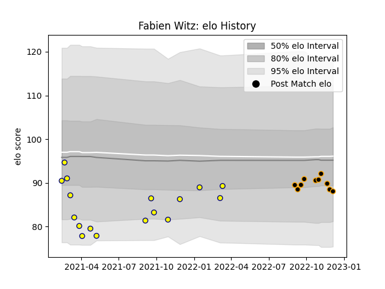

---  
layout: page  
title: Fabien Witz  
date: 2022-12-14 11:34:13.999136  
categories: player  
---
# Fabien Witz

## Positions: L

## Current elo: 90.0

## Current Percentile: 22.0

# Elo History

# Match History

| Team     |   Appearances |   Win Rate |
|:---------|--------------:|-----------:|
| Nevers   |            17 |   0.294118 |
| Chambery |            11 |   0.454545 |

| Opponent                   |   Matches |   Win Rate |
|:---------------------------|----------:|-----------:|
| Mont-de-Marsan             |         2 |        0.5 |
| Valence Romans Drome Rugby |         2 |        0.5 |
| US Bressane                |         2 |        0.5 |
| Grenoble                   |         2 |        0   |
| Narbonne                   |         2 |        1   |
| Montauban                  |         1 |        1   |
| Tarbes                     |         1 |        1   |
| Suresnes                   |         1 |        0   |
| Rouen                      |         1 |        0   |
| Provence Rugby             |         1 |        0   |
| Perpignan                  |         1 |        0   |
| Nice                       |         1 |        1   |
| Albi                       |         1 |        0   |
| Bayonne                    |         1 |        0.5 |
| Dax                        |         1 |        0   |
| Colomiers                  |         1 |        0   |
| Cognac Saint Jean d'Angély |         1 |        1   |
| Carqueiranne-Hyères        |         1 |        0   |
| Carcassonne                |         1 |        0   |
| Bourgoin-Jallieu           |         1 |        0   |
| Biarritz Olympique         |         1 |        0   |
| Beziers                    |         1 |        0   |
| Vannes                     |         1 |        0.5 |