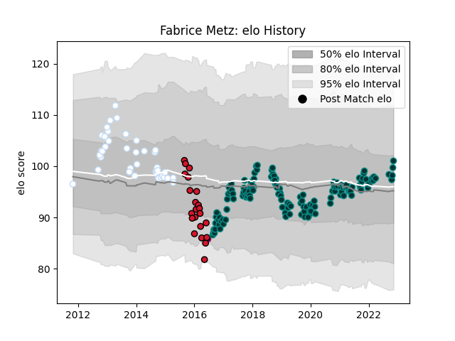

---  
layout: page  
title: Fabrice Metz  
date: 2022-11-16 11:24:25.239894  
categories: player  
---
# Fabrice Metz

## Positions: L

## Country: France

## Current elo: 101.0

## Current Percentile: 67.0

# Elo History

# Match History

| Team      |   Appearances |   Win Rate |
|:----------|--------------:|-----------:|
| Pau       |           139 |   0.44964  |
| Racing 92 |            40 |   0.5      |
| Oyonnax   |            22 |   0.181818 |
| France    |             1 |   0        |

| Opponent             |   Matches |   Win Rate |
|:---------------------|----------:|-----------:|
| Castres Olympique    |        16 |   0.4375   |
| Stade Toulousain     |        15 |   0.266667 |
| Stade Francais Paris |        14 |   0.357143 |
| Clermont Auvergne    |        14 |   0.357143 |
| La Rochelle          |        13 |   0.153846 |
| Bordeaux Begles      |        13 |   0.461538 |
| Montpellier Herault  |        13 |   0.423077 |
| Brive                |        12 |   0.5      |
| Racing 92            |        12 |   0.25     |
| Lyon                 |        11 |   0.545455 |
| Toulon               |        11 |   0.272727 |
| Agen                 |        10 |   0.9      |
| Grenoble             |         8 |   0.375    |
| Bayonne              |         6 |   0.916667 |
| Perpignan            |         4 |   0.75     |
| Saracens             |         3 |   0        |
| Oyonnax              |         2 |   0.5      |
| Worcester Warriors   |         2 |   0.5      |
| Ulster               |         2 |   0        |
| Biarritz Olympique   |         2 |   1        |
| Scarlets             |         2 |   0.25     |
| Cardiff Blues        |         2 |   0.5      |
| Zebre                |         2 |   1        |
| Munster              |         2 |   0.5      |
| Gloucester Rugby     |         2 |   1        |
| Harlequins           |         1 |   0        |
| Ospreys              |         1 |   0        |
| Edinburgh            |         1 |   1        |
| Mont-de-Marsan       |         1 |   1        |
| Bristol Rugby        |         1 |   0        |
| Argentina            |         1 |   0        |
| London Irish         |         1 |   0        |
| Leicester Tigers     |         1 |   0        |
| Pau                  |         1 |   1        |