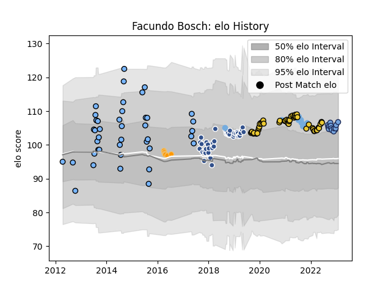

---  
layout: page  
title: Facundo Bosch  
date: 2022-12-18 16:30:30.672599  
categories: player  
---
# Facundo Bosch

## Positions: H

## Country: Argentina

## Current elo: 106.0

## Current Percentile: 84.0

# Elo History

# Match History

| Team        |   Appearances |   Win Rate |
|:------------|--------------:|-----------:|
| Agen        |            45 |   0.388889 |
| La Rochelle |            44 |   0.568182 |
| CUBA        |            37 |   0.756757 |
| Bayonne     |            11 |   0.545455 |
| Argentina   |            10 |   0.45     |
| Jaguares    |             6 |   0.166667 |

| Opponent             |   Matches |   Win Rate |
|:---------------------|----------:|-----------:|
| Stade Toulousain     |         8 |   0.125    |
| Stade Francais Paris |         8 |   0.5      |
| Montpellier Herault  |         8 |   0.375    |
| Bordeaux Begles      |         8 |   0.5      |
| Racing 92            |         7 |   0.571429 |
| Toulon               |         7 |   0.571429 |
| Lyon                 |         7 |   0.571429 |
| Castres Olympique    |         7 |   0.428571 |
| Pau                  |         6 |   0.5      |
| Perpignan            |         5 |   0.8      |
| La Rochelle          |         5 |   0.4      |
| Clermont Auvergne    |         4 |   0.25     |
| Belgrano             |         4 |   0.75     |
| Alumni               |         4 |   1        |
| La Plata             |         4 |   0.75     |
| Hindu                |         3 |   0        |
| Regatas Bella Vista  |         3 |   1        |
| SIC                  |         3 |   1        |
| Newman               |         3 |   0.333333 |
| South Africa         |         3 |   0.333333 |
| Agen                 |         3 |   1        |
| CASI                 |         3 |   1        |
| Grenoble             |         3 |   0.833333 |
| Brive                |         3 |   0.333333 |
| New Zealand          |         2 |   0.5      |
| Atlético del Rosario |         2 |   0.5      |
| Bayonne              |         2 |   1        |
| Benetton Treviso     |         2 |   0.5      |
| San Luis             |         2 |   0.5      |
| Pueyrredón           |         2 |   1        |
| Exeter Chiefs        |         2 |   0        |
| Wales                |         2 |   0.75     |
| Lions                |         2 |   0.5      |
| France               |         1 |   0        |
| Lomas                |         1 |   1        |
| Harlequins           |         1 |   0        |
| Sunwolves            |         1 |   0        |
| Australia            |         1 |   0        |
| Liceo Naval          |         1 |   1        |
| Scarlets             |         1 |   0        |
| Biarritz Olympique   |         1 |   0        |
| Oyonnax              |         1 |   1        |
| Blues                |         1 |   0        |
| Glasgow Warriors     |         1 |   1        |
| Manuel Belgrano      |         1 |   1        |
| Pucara               |         1 |   1        |
| Italy                |         1 |   1        |
| Crusaders            |         1 |   0        |
| Hurricanes           |         1 |   0        |