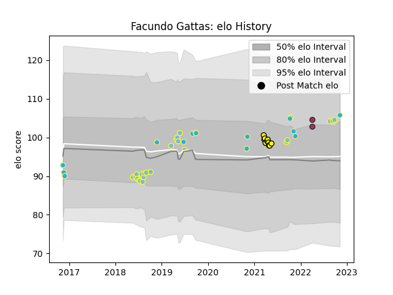

---  
layout: page  
title: Facundo Gattas  
date: 2023-03-21 18:45:44.840637  
categories: player  
---
# Facundo Gattas

Last updated: 2023-03-21
## Positions: H, P

## Country: Uruguay

## Current elo: 106.0

## Current Percentile: 76.0

# Elo History

# Match History

| Team          |   Appearances |   Win Rate |
|:--------------|--------------:|-----------:|
| Hindu         |            24 |   0.770833 |
| Uruguay       |            14 |   0.357143 |
| Penarol Rugby |            10 |   0.7      |
| Old Glory DC  |             2 |   0        |

| Opponent                 |   Matches |   Win Rate |
|:-------------------------|----------:|-----------:|
| Pucara                   |         5 |   0.6      |
| Spain                    |         4 |   0.25     |
| Alumni                   |         3 |   0.666667 |
| CASI                     |         3 |   0.666667 |
| Romania                  |         3 |   0.333333 |
| Lomas                    |         2 |   1        |
| Selknam                  |         2 |   0.5      |
| San Luis                 |         2 |   1        |
| Olimpia Lions            |         2 |   1        |
| Newman                   |         2 |   0.5      |
| Jaguares XV              |         2 |   0        |
| Georgia                  |         2 |   0        |
| Cobras                   |         2 |   1        |
| Cafeteros Pro            |         2 |   1        |
| CUBA                     |         2 |   1        |
| Germany                  |         1 |   0        |
| Italy                    |         1 |   0        |
| Atlético del Rosario     |         1 |   1        |
| Fiji                     |         1 |   1        |
| R.U. New York            |         1 |   0        |
| Regatas Bella Vista      |         1 |   0.5      |
| Rugby New York           |         1 |   0        |
| Buenos Aires             |         1 |   1        |
| San Martin               |         1 |   1        |
| Brazil                   |         1 |   1        |
| Belgrano                 |         1 |   1        |
| United States of America |         1 |   1        |