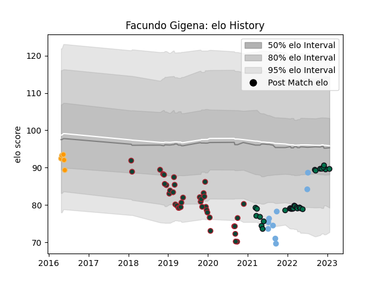

---  
layout: page  
title: Facundo Gigena  
date: 2023-03-21 18:02:09.625445  
categories: player  
---
# Facundo Gigena

Last updated: 2023-03-21
## Positions: P

## Country: Argentina

## Current elo: 99.0

## Current Percentile: 61.0

# Elo History

# Match History

| Team             |   Appearances |   Win Rate |
|:-----------------|--------------:|-----------:|
| Leicester Tigers |            39 |   0.294872 |
| London Irish     |            36 |   0.402778 |
| Argentina        |             9 |   0.5      |
| Jaguares         |             5 |   0.2      |

| Opponent            |   Matches |   Win Rate |
|:--------------------|----------:|-----------:|
| Gloucester Rugby    |         6 |   0.333333 |
| Bath Rugby          |         6 |   0.333333 |
| Worcester Warriors  |         5 |   0.6      |
| Newcastle Falcons   |         5 |   0.8      |
| Saracens            |         5 |   0.2      |
| Exeter Chiefs       |         5 |   0.2      |
| Sale Sharks         |         5 |   0.3      |
| Harlequins          |         5 |   0.1      |
| Northampton Saints  |         5 |   0.2      |
| Bristol Rugby       |         4 |   0.25     |
| Wasps               |         4 |   0.375    |
| Pau                 |         3 |   0.666667 |
| Leicester Tigers    |         3 |   0        |
| Montpellier Herault |         2 |   0.25     |
| Cardiff Blues       |         2 |   1        |
| Calvisano           |         2 |   1        |
| Wales               |         2 |   0.75     |
| Toulon              |         2 |   0        |
| Southern Kings      |         2 |   0.5      |
| New Zealand         |         2 |   0        |
| Scarlets            |         2 |   0.5      |
| Georgia             |         1 |   1        |
| Romania             |         1 |   1        |
| Sharks              |         1 |   0        |
| South Africa        |         1 |   0        |
| Racing 92           |         1 |   0        |
| Stormers            |         1 |   0        |
| Sunwolves           |         1 |   0        |
| Portugal            |         1 |   1        |
| Ulster              |         1 |   0        |
| Lions               |         1 |   0        |
| London Irish        |         1 |   0        |
| Australia           |         1 |   0        |