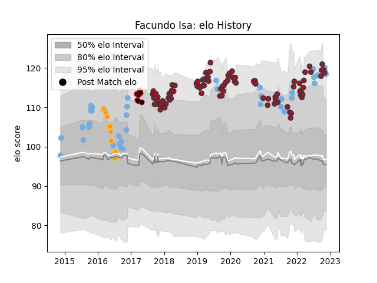

---  
layout: page  
title: Facundo Isa  
date: 2022-12-09 13:14:12.865898  
categories: player  
---
# Facundo Isa

## Positions: FL, N8

## Country: Argentina

## Current elo: 118.0

## Current Percentile: 93.0

# Elo History

# Match History

| Team      |   Appearances |   Win Rate |
|:----------|--------------:|-----------:|
| Toulon    |            94 |   0.574468 |
| Argentina |            39 |   0.448718 |
| Jaguares  |            13 |   0.307692 |
| Lyon      |             7 |   0.714286 |

| Opponent             |   Matches |   Win Rate |
|:---------------------|----------:|-----------:|
| La Rochelle          |         9 |   0.555556 |
| Stade Francais Paris |         9 |   0.777778 |
| Lyon                 |         9 |   0.555556 |
| Stade Toulousain     |         7 |   0.428571 |
| Pau                  |         7 |   0.928571 |
| Castres Olympique    |         7 |   0.571429 |
| Montpellier Herault  |         7 |   0.357143 |
| Clermont Auvergne    |         7 |   0.571429 |
| Australia            |         7 |   0.285714 |
| Racing 92            |         6 |   0.166667 |
| Brive                |         6 |   0.5      |
| South Africa         |         5 |   0.2      |
| Scotland             |         5 |   0.4      |
| France               |         4 |   0.5      |
| New Zealand          |         4 |   0        |
| Wales                |         4 |   0.375    |
| Bordeaux Begles      |         4 |   0.75     |
| Agen                 |         3 |   0.666667 |
| Perpignan            |         3 |   0.666667 |
| Bayonne              |         3 |   1        |
| Italy                |         3 |   1        |
| Scarlets             |         3 |   0.666667 |
| Bath Rugby           |         2 |   0.5      |
| Southern Kings       |         2 |   0.5      |
| Sharks               |         2 |   0        |
| Biarritz Olympique   |         2 |   1        |
| England              |         2 |   0.5      |
| Lions                |         2 |   0.5      |
| Crusaders            |         1 |   0        |
| Japan                |         1 |   1        |
| Tonga                |         1 |   1        |
| Sunwolves            |         1 |   0        |
| Stormers             |         1 |   0        |
| Grenoble             |         1 |   0        |
| Highlanders          |         1 |   0        |
| Ireland              |         1 |   1        |
| Benetton Treviso     |         1 |   1        |
| Edinburgh            |         1 |   0        |
| Chiefs               |         1 |   0        |
| Leicester Tigers     |         1 |   1        |
| London Irish         |         1 |   1        |
| Bulls                |         1 |   1        |
| Oyonnax              |         1 |   0        |
| Georgia              |         1 |   1        |
| Namibia              |         1 |   1        |
| Munster              |         1 |   0        |
| Cheetahs             |         1 |   1        |