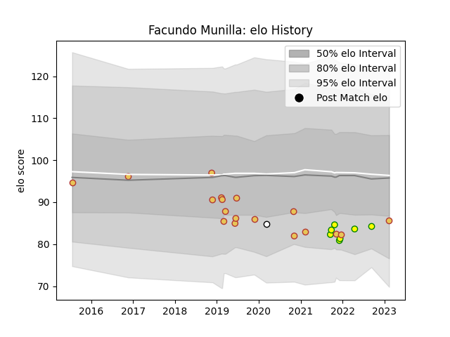

---  
layout: page  
title: Facundo Munilla  
date: 2023-02-15 22:14:18.493547  
categories: player  
---
# Facundo Munilla

## Positions: SH

## Country: Spain

## Current elo: 86.0

## Current Percentile: 20.0

# Elo History

# Match History

| Team                     |   Appearances |   Win Rate |
|:-------------------------|--------------:|-----------:|
| Spain                    |            18 |   0.722222 |
| Castilla y Leon Iberians |             7 |   0.571429 |
| Olimpia Lions            |             1 |   0        |

| Opponent        |   Matches |   Win Rate |
|:----------------|----------:|-----------:|
| Uruguay         |         4 |       0.75 |
| Brussels Devils |         3 |       1    |
| Lusitanos XV    |         2 |       0    |
| Germany         |         2 |       1    |
| Samoa           |         1 |       0    |
| Russia          |         1 |       1    |
| Romania         |         1 |       1    |
| Portugal        |         1 |       1    |
| Netherlands     |         1 |       1    |
| Namibia         |         1 |       1    |
| Black Lion      |         1 |       0    |
| Kenya           |         1 |       0    |
| Brazil          |         1 |       1    |
| Georgia         |         1 |       0    |
| Fiji            |         1 |       0    |
| Delta           |         1 |       1    |
| Chile           |         1 |       1    |
| Ceibos Rugby    |         1 |       0    |
| Hong Kong       |         1 |       1    |