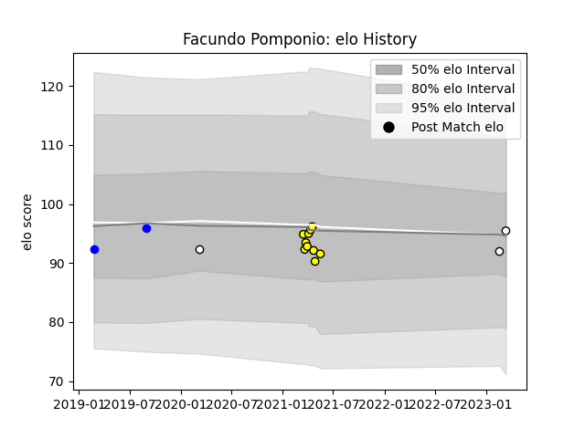

---  
layout: page  
title: Facundo Pomponio  
date: 2023-03-17 17:05:08.929891  
categories: player  
---
# Facundo Pomponio

## Positions: P

## Current elo: 95.0

## Current Percentile: 38.0

# Elo History

# Match History

| Team          |   Appearances |   Win Rate |
|:--------------|--------------:|-----------:|
| Penarol Rugby |            10 |        0.7 |
| Vannes        |             2 |        0   |
| Yacare XV     |             2 |        0.5 |
| Olimpia Lions |             1 |        0   |

| Opponent           |   Matches |   Win Rate |
|:-------------------|----------:|-----------:|
| Cafeteros Pro      |         2 |        1   |
| Cobras             |         2 |        1   |
| Jaguares XV        |         2 |        0   |
| Olimpia Lions      |         2 |        1   |
| Selknam            |         2 |        0.5 |
| American Raptors   |         1 |        1   |
| Biarritz Olympique |         1 |        0   |
| Brive              |         1 |        0   |
| Ceibos Rugby       |         1 |        0   |
| Dogos XV           |         1 |        0   |