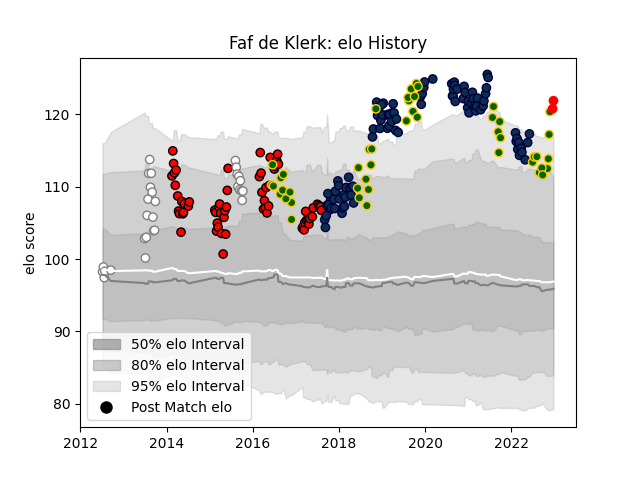

---  
layout: page  
title: Faf de Klerk  
date: 2022-11-22 11:37:40.071702  
categories: player  
---
# Faf de Klerk

## Positions: SH

## Country: South Africa

## Current elo: 117.0

## Current Percentile: 92.0

# Elo History

# Match History

| Team         |   Appearances |   Win Rate |
|:-------------|--------------:|-----------:|
| Sale Sharks  |            95 |   0.594737 |
| Lions        |            64 |   0.664062 |
| South Africa |            44 |   0.556818 |
| Pumas        |            23 |   0.717391 |

| Opponent                 |   Matches |   Win Rate |
|:-------------------------|----------:|-----------:|
| Northampton Saints       |        10 |   0.7      |
| Exeter Chiefs            |         9 |   0.111111 |
| Bath Rugby               |         9 |   0.444444 |
| Sharks                   |         9 |   0.666667 |
| New Zealand              |         9 |   0.388889 |
| Argentina                |         8 |   0.75     |
| Gloucester Rugby         |         7 |   0.857143 |
| Wasps                    |         6 |   0.666667 |
| Stormers                 |         6 |   0.583333 |
| Saracens                 |         6 |   0.333333 |
| Newcastle Falcons        |         6 |   0.333333 |
| London Irish             |         6 |   0.916667 |
| Leicester Tigers         |         6 |   0.666667 |
| Australia                |         6 |   0.166667 |
| Harlequins               |         6 |   0.666667 |
| Worcester Warriors       |         6 |   0.666667 |
| Cheetahs                 |         6 |   1        |
| Bristol Rugby            |         6 |   0.916667 |
| Bulls                    |         6 |   0.666667 |
| England                  |         5 |   0.6      |
| Crusaders                |         5 |   0.2      |
| Wales                    |         4 |   0.75     |
| Southern Kings           |         4 |   1        |
| Highlanders              |         4 |   0.5      |
| Hurricanes               |         4 |   0.25     |
| Ireland                  |         4 |   0.5      |
| Eastern Province Kings   |         4 |   1        |
| Valke                    |         3 |   1        |
| Blues                    |         3 |   1        |
| Queensland Reds          |         3 |   1        |
| New South Wales Waratahs |         3 |   0.666667 |
| Jaguares                 |         3 |   0.666667 |
| Connacht                 |         3 |   0.666667 |
| La Rochelle              |         2 |   0.5      |
| Perpignan                |         2 |   1        |
| Western Force            |         2 |   0.5      |
| France                   |         2 |   0.5      |
| Golden Lions             |         2 |   0        |
| Griffons                 |         2 |   1        |
| Boland Cavaliers         |         2 |   1        |
| Leopards                 |         2 |   1        |
| SWD Eagles               |         2 |   1        |
| Bordeaux Begles          |         2 |   0.5      |
| British and Irish Lions  |         2 |   0.5      |
| Italy                    |         2 |   1        |
| Chiefs                   |         2 |   0.5      |
| Melbourne Rebels         |         2 |   1        |
| Japan                    |         2 |   1        |
| Natal Sharks             |         2 |   0.5      |
| Griquas                  |         1 |   0        |
| Brumbies                 |         1 |   0        |
| Scarlets                 |         1 |   1        |
| Stade Toulousain         |         1 |   0.5      |
| Sunwolves                |         1 |   1        |
| Free State Cheetahs      |         1 |   0.5      |
| Lyon                     |         1 |   0        |
| Blue Bulls               |         1 |   0        |
| Western Province         |         1 |   0        |