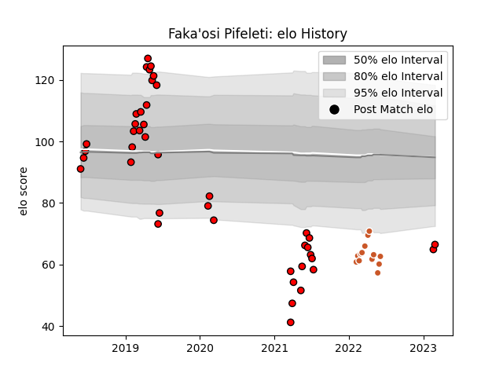

---  
layout: page  
title: Faka'osi Pifeleti  
date: 2023-03-02 11:20:24.673186  
categories: player  
---
# Faka'osi Pifeleti

## Positions: P

## Current elo: 66.0

## Current Percentile: 2.0

# Elo History

# Match History

| Team             |   Appearances |   Win Rate |
|:-----------------|--------------:|-----------:|
| San Diego Legion |            42 |   0.678571 |
| Austin Gilgronis |            13 |   0.846154 |

| Opponent               |   Matches |   Win Rate |
|:-----------------------|----------:|-----------:|
| Seattle Seawolves      |         8 |   0.75     |
| Utah Warriors          |         6 |   0.666667 |
| Houston SaberCats      |         5 |   1        |
| R.U. New York          |         5 |   0.6      |
| NOLA Gold              |         5 |   1        |
| Austin Elite Rugby     |         4 |   0.75     |
| Glendale Raptors       |         3 |   0.833333 |
| Rugby New York         |         3 |   0.666667 |
| Toronto Arrows         |         3 |   0.333333 |
| L. A. Giltinis         |         2 |   0.5      |
| Austin Gilgronis       |         2 |   0.5      |
| Old Glory DC           |         2 |   0.5      |
| San Diego Legion       |         2 |   1        |
| New England Free Jacks |         2 |   0.5      |
| Dallas Jackals         |         1 |   1        |
| Rugby ATL              |         1 |   0        |
| Colorado Raptors       |         1 |   1        |