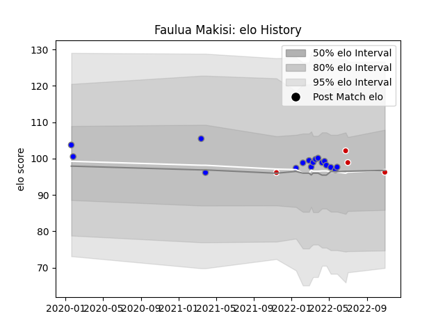

---  
layout: page  
title: Faulua Makisi  
date: 2023-03-17 17:36:56.479064  
categories: player  
---
# Faulua Makisi

## Positions: N8, FL

## Country: Japan

## Current elo: 96.0

## Current Percentile: 63.0

# Elo History

# Match History

| Team                              |   Appearances |   Win Rate |
|:----------------------------------|--------------:|-----------:|
| Kubota Spears Funabashi Tokyo-Bay |            17 |   0.764706 |
| Japan                             |             4 |   0.5      |

| Opponent                        |   Matches |   Win Rate |
|:--------------------------------|----------:|-----------:|
| Mie Honda Heat                  |         2 |        1   |
| Saitama Wild Knights            |         2 |        0   |
| Toshiba Brave Lupus Tokyo       |         2 |        1   |
| Urayasu D-Rocks                 |         2 |        1   |
| Yokohama Canon Eagles           |         2 |        0.5 |
| France                          |         1 |        0   |
| Green Rockets Tokatsu           |         1 |        1   |
| Kobelco Kobe Steelers           |         1 |        1   |
| Mitsubishi Dynaboars            |         1 |        1   |
| NTT Docomo Red Hurricanes Osaka |         1 |        1   |
| New Zealand                     |         1 |        0   |
| Portugal                        |         1 |        1   |
| Shizuoka Blue Revs              |         1 |        1   |
| Tokyo Sungoliath                |         1 |        0   |
| Toyota Verblitz                 |         1 |        1   |
| Uruguay                         |         1 |        1   |