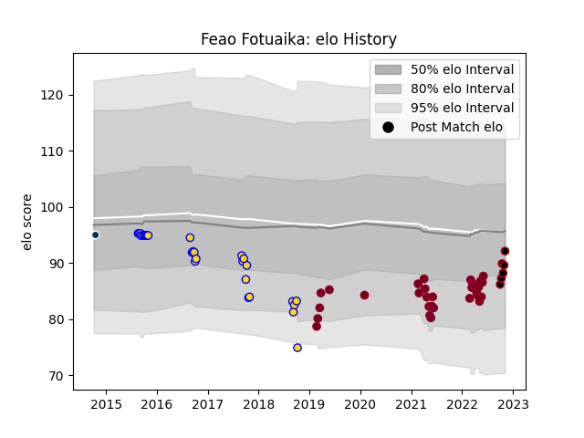

---  
layout: page  
title: Feao Fotuaika  
date: 2023-02-26 11:19:06.904818  
categories: player  
---
# Feao Fotuaika

## Positions: P

## Current elo: 92.0

## Current Percentile: 29.0

# Elo History

# Match History

| Team               |   Appearances |   Win Rate |
|:-------------------|--------------:|-----------:|
| Queensland Reds    |            31 |   0.483871 |
| Brisbane City      |            28 |   0.625    |
| Lyon               |             6 |   0.666667 |
| Queensland Country |             3 |   0.333333 |

| Opponent                 |   Matches |   Win Rate |
|:-------------------------|----------:|-----------:|
| Brumbies                 |         6 |   0.666667 |
| Canberra Vikings         |         4 |   0.75     |
| Queensland Country       |         4 |   0.75     |
| Perth Spirit             |         4 |   0.25     |
| Crusaders                |         4 |   0        |
| NSW Country Eagles       |         4 |   0.625    |
| Melbourne Rising         |         3 |   0.333333 |
| Melbourne Rebels         |         3 |   1        |
| Sydney Stars             |         3 |   1        |
| New South Wales Waratahs |         3 |   1        |
| Western Force            |         3 |   0.333333 |
| Highlanders              |         3 |   0        |
| Fijian Drua              |         3 |   0.666667 |
| Chiefs                   |         3 |   0.333333 |
| Hurricanes               |         2 |   0        |
| Greater Sydney Rams      |         2 |   0.5      |
| North Harbour Rays       |         2 |   0.5      |
| Sydney Rays              |         2 |   1        |
| Blues                    |         2 |   0        |
| Bordeaux Begles          |         1 |   1        |
| Moana Pasifika           |         1 |   1        |
| Montpellier Herault      |         1 |   1        |
| Pau                      |         1 |   1        |
| Perpignan                |         1 |   0        |
| Clermont Auvergne        |         1 |   0        |
| Sunwolves                |         1 |   1        |
| Castres Olympique        |         1 |   1        |