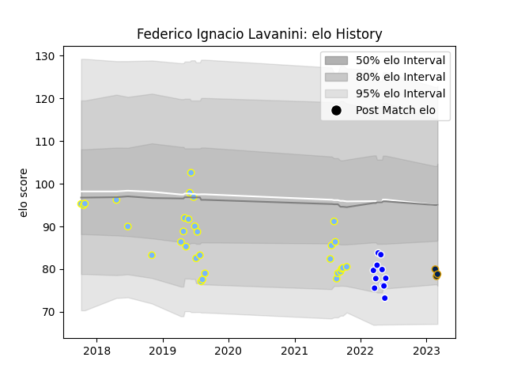

---  
layout: page  
title: Federico Ignacio Lavanini  
date: 2023-03-04 11:41:10.516265  
categories: player  
---
# Federico Ignacio Lavanini

## Positions: L

## Current elo: 79.0

## Current Percentile: 11.0

# Elo History

# Match History

| Team          |   Appearances |   Win Rate |
|:--------------|--------------:|-----------:|
| Hindu         |            31 |   0.725806 |
| Cafeteros Pro |            11 |   0.363636 |
| Pampas XV     |             3 |   0.666667 |

| Opponent             |   Matches |   Win Rate |
|:---------------------|----------:|-----------:|
| Alumni               |         4 |       0.75 |
| CASI                 |         4 |       0.5  |
| Cobras               |         3 |       1    |
| Regatas Bella Vista  |         3 |       1    |
| Pucara               |         3 |       0.5  |
| Penarol Rugby        |         3 |       0    |
| Selknam              |         3 |       0    |
| CUBA                 |         3 |       1    |
| Jaguares XV          |         2 |       0    |
| Newman               |         2 |       0    |
| Olimpia Lions        |         2 |       1    |
| Belgrano             |         2 |       0.5  |
| Atlético del Rosario |         2 |       1    |
| SIC                  |         2 |       0.5  |
| San Luis             |         2 |       1    |
| La Plata             |         1 |       1    |
| American Raptors     |         1 |       1    |
| Buenos Aires         |         1 |       1    |
| San Martin           |         1 |       1    |
| Los Tilos            |         1 |       1    |