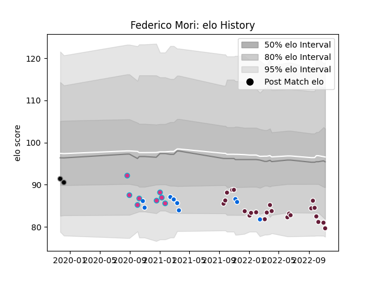

---  
layout: page  
title: Federico Mori  
date: 2022-11-16 11:39:00.768872  
categories: player  
---
# Federico Mori

## Positions: W, C

## Country: Italy

## Current elo: 80.0

## Current Percentile: 7.0

# Elo History

# Match History

| Team            |   Appearances |   Win Rate |
|:----------------|--------------:|-----------:|
| Bordeaux Begles |            23 |   0.543478 |
| Italy           |             9 |   0        |
| Zebre           |             8 |   0.5      |
| Calvisano       |             2 |   0        |

| Opponent             |   Matches |   Win Rate |
|:---------------------|----------:|-----------:|
| Benetton Treviso     |         4 |   0.75     |
| Pau                  |         3 |   0        |
| Brive                |         3 |   1        |
| Castres Olympique    |         3 |   0.833333 |
| England              |         3 |   0        |
| Stade Francais Paris |         2 |   1        |
| Clermont Auvergne    |         2 |   0.5      |
| Ireland              |         2 |   0        |
| Perpignan            |         2 |   0.5      |
| Leicester Tigers     |         2 |   0        |
| Lyon                 |         2 |   0.5      |
| Montpellier Herault  |         2 |   0        |
| Argentina            |         1 |   0        |
| Toulon               |         1 |   1        |
| Scotland             |         1 |   0        |
| Racing 92            |         1 |   1        |
| La Rochelle          |         1 |   0        |
| New Zealand          |         1 |   0        |
| Bayonne              |         1 |   0        |
| Edinburgh            |         1 |   0        |
| Dragons              |         1 |   0        |
| Cardiff Blues        |         1 |   0        |
| Biarritz Olympique   |         1 |   1        |
| Wales                |         1 |   0        |